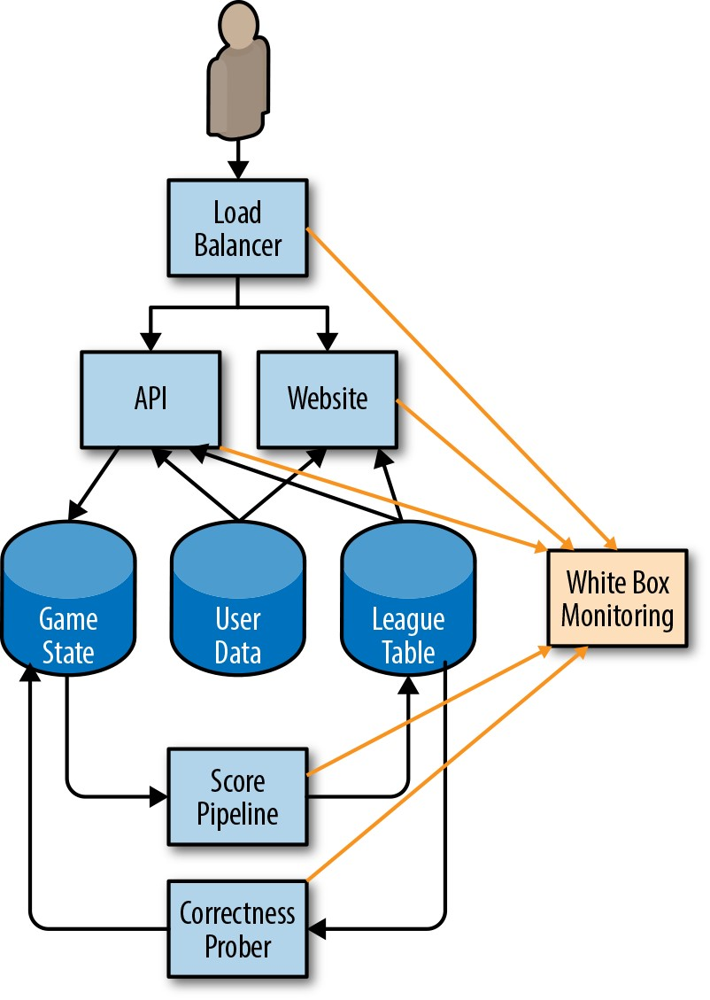

# PART I 基础

每个实施指南都需要从一个共同的基础开始。在这种情况下，SRE的基本基础包括*SLO，监控，警报，减少人工和简化*。正确掌握这些基础知识将为您在SRE旅途中取得成功做好准备。

以下各章探讨了将这些核心原则转变为组织的具体实践的技术。

 
 

# 第2章

### 实施SLO
 

***史蒂文·瑟古德(Steven Thurgood)和大卫·弗格森(David Ferguson)以及亚历克斯·希达尔戈(Alex Hidalgo)和贝茜·拜尔(Betsy Beyer)***

 
 

*服务水平目标*(SLO)指定了服务可靠性的目标水平。由于SLO是做出以数据为依据的可靠性决策的关键，因此它们是SRE实践的核心。在许多方面，这是本书中最重要的章节。

一旦掌握了一些准则，设置初始SLO以及完善它们的过程就很简单了。[第4章](http://bit.ly/2szBKsK)介绍了SLO和SLI(服务级别指标)的主题，并提供了有关如何使用它们的一些建议。

在讨论了SLO和错误预算背后的动机之后，本章提供了逐步指南，可让您开始考虑SLO，并提供了一些有关如何从那里进行迭代的建议。然后，我们将介绍如何使用SLO做出有效的业务决策，并探讨一些高级主题。最后，我们将为您提供一些针对不同类型服务的SLO的示例，以及一些有关在特定情况下如何创建更复杂的SLO的指针。[^22]

## **为什么SRE需要SLO**

即使是最大的组织，工程师也是稀缺资源。应将工程时间用于最重要服务的最重要特征。要在赢得新客户或留住现有客户的功能性投资与将使这些客户满意的可靠性和可扩展性方面进行投资之间取得正确的平衡，是很难的。在Google，我们了解到，经过深思熟虑并采用的SLO是就可靠性工作的机会成本做出数据明智的决定并确定如何适当地确定工作优先级的关键。

SRE的核心职责不仅仅是使“所有事物"自动化并保持On-Call。他们的日常任务和项目由SLO推动:确保SLO在短期内得到捍卫，并在中长期内得到维护。甚至可以说没有SLO，就不需要SRE。SLO是一种工具，可帮助您确定要优先处理的工程工作。例如，请考虑两个可靠性项目的工程设计权衡:自动回滚和移至复制的数据存储。通过计算对错误预算的估计影响，我们可以确定哪个项目对我们的用户最有利。有关更多详细信息，请参见第37页的“使用SLO和错误预算进行决策", 以及*《站点可靠性工程》中的[“管理风险"](http://bit.ly/2xzGm83)。

## **入门**

作为建立一组基本SLO的起点，让我们假设您的服务是某种形式的代码，已被编译和发布，并且在用户通过Web访问的联网基础结构上运行。系统的成熟度级别可能是以下之一:

- 未开发项目，目前未部署

- 一个生产中的系统，带有一些监控功能，可在出现问题时通知您，但没有正式的目标，没有错误预算的概念，并且有100％正常运行时间的潜意识目标

- 正在运行的部署SLO低于100％，但是对其重要性或如何利用其做出持续改进选择没有共识，换句话说，SLO毫无用处

为了对站点可靠性工程采用基于错误预算的方法，您需要达到以下条件成立的状态:

- 组织中的所有利益相关者都已批准了适用于该产品的SLO。

- 负责确保服务符合其SLO的人员已同意在正常情况下可以满足此SLO。

- 组织已承诺将错误预算用于决策和确定优先级。此承诺已在错误预算政策中正式化。

- 有完善SLO的流程。

否则，您将无法采用基于错误预算的方法来提高可靠性。SLO合规性将仅仅是另一个KPI(关键绩效指标)或报告指标，而不是决策工具。

**可靠性目标和错误预算**

制定适当的SLO的第一步是讨论SLO应该是什么以及应该涵盖什么。

SLO为服务的客户设置了目标可靠性级别。高于此阈值，几乎所有用户都应该对您的服务感到满意(假设他们对服务的实用性感到满意)。[^23]低于此阈值，用户可能会开始抱怨或停止使用该服务。最终，用户的幸福才是最重要的-幸福的用户使用该服务，为您的组织创造收入，对您的客户支持团队提出低要求并向其朋友推荐该服务。我们保持可靠的服务，以使客户满意。

客户满意度是一个相当模糊的概念。我们无法精确测量。通常我们对此几乎没有任何了解，那么我们如何开始呢？我们的第一个SLO使用什么？

我们的经验表明，100％的可靠性是错误的目标:

- 如果您的SLO与客户满意度保持一致，那么100％并不是一个合理的目标。即使具有冗余组件，自动运行状况检查和快速故障转移，一个或多个组件同时发生故障的可能性也不为零，从而导致可用性不到100％。

- 即使您可以在系统中实现100％的可靠性，您的客户也不会体验到100％的可靠性。您和客户之间的系统链通常很长而且很复杂，并且其中任何一个组件都可能发生故障。[^24]这也意味着，当您从99％变为99.9％到99.99％的可靠性时，每增加9个可靠性成本增加，但对客户的边际效用却稳定地接近零。

- 如果您确实设法为客户创造了100％可靠的体验，并且想要保持这种可靠性，那么您将永远无法更新或改善服务。停机的第一大原因是变化:推出新功能，应用安全补丁，部署新硬件以及扩大规模以满足客户需求，将对100％的目标产生影响。迟早，您的服务将停滞，您的客户将前往其他地方，这对任何人的底线都不利。

- 100％的SLO意味着您只有时间进行反应。实际上，您只能对\<100％的可用性做出反应，这是可以保证的。100％的可靠性不是工程文化的SLO，而是运维团队SLO。

一旦SLO目标低于100％，它就必须由组织中有权在速度特征和可靠性之间进行权衡的人来把控。在小型组织中，这可能是CTO。在大型组织中，通常是产品所有者(或产品经理)。

**度量方法:使用SLI**

一旦您同意100％是错误的数字，您将如何确定正确的数字？您到底在测量什么？服务水平指示器(SLI)在这里起作用:SLI是您提供的服务水平的“指示器"。尽管许多数字可以用作SLI，但我们通常建议将SLI视为两个数字的比值:好事件的数量除以事件的总数。例如:

- 成功的HTTP请求数/总HTTP请求数(成功率)

- 在<100毫秒内成功完成的gRPC调用次数/总gRPC请求数

- 使用了整个语料库的搜索结果数/搜索结果总数，包括正常降低的搜索结果数

- 使用少于10分钟的库存数据的产品搜索发出的“库存检查计数"请求数/库存检查请求总数

- 根据该指标的某些扩展标准列表得出的“良好用户分钟数" /用户分钟总数

这种形式的SLI具有几个特别有用的属性。SLI的范围是0％到100％，其中0％表示没有任何作用，而100％表示没有损坏。我们发现这种规模很直观，并且这种风格很容易将其应用于错误预算的概念:SLO是目标百分比，错误预算是100％减去SLO。例如，如果您有99.9％的成功SLO，则在四个星期的时间内收到300万个请求的服务在此期间的预算错误为3,000(0.1％)。如果一次中断造成1,500个错误，则该错误将花费错误预算的50％。[^25]

此外，使所有SLI遵循一致的样式可以使您更好地利用工具:可以编写警报逻辑，SLO分析工具，错误预算计算和报告以期望输入相同的值:分子，分母和阈值。在这里简化是一个好处。

首次尝试制定SLI时，您可能会发现将SLI进一步分为*SLI规范*和*SLI实现*很有用:

*SLI规格*

>您认为对用户至关重要的服务结果的评估，与评估结果的方式无关。
>例如: <100毫秒内加载的主页请求的比率

*SLI实施*

>SLI规范及其度量方法。
>例如:

>- 从服务器日志的“延迟"列中测算，首页请求在\<100毫秒内加载的比率。此度量将错过未能到达后端的请求。

>- 在小于100毫秒内加载的首页请求的比例，由在虚拟机中运行的浏览器中执行JavaScript的探测器测量。当请求无法到达我们的网络时，此度量将捕获错误，但可能会丢失仅影响一部分用户的问题。

>- 主页请求在\<100毫秒内加载的比率，该比率通过主页上JavaScript本身的检测进行测量，并报告回专用遥测记录服务。尽管我们现在需要修改代码以捕获此信息并构建用于记录该信息的基础结构，但此度量将更准确地捕获用户体验，该规范具有其自身的可靠性要求。

如您所见，单个SLI规范可能具有多个SLI实现，每个实现都有自己的一套利弊，包括质量(他们捕获客户体验的准确程度)，覆盖范围(他们捕获所有客户的体验的程度客户)和成本。

您第一次尝试SLI和SLO不一定正确。最重要的目标是进行适当的测量并建立反馈环路，以便您进行改进。(我们在第34页的“持续改进SLO目标"中更深入地探讨了此主题。)

在[我们的第一本书](http://bit.ly/2kIcNYM)中，我们建议不要根据当前的性能来选择SLO，因为这会使您不必要地严格执行SLO。尽管该建议是正确的，但是如果您没有其他信息，并且有适当的迭代过程(稍后将进行介绍)，则可以将当前的性能作为一个不错的起点。但是，在优化SLO时，不要让当前的性能受到限制:客户还会期望您的服务在其SLO上运行，因此，如果您的服务在不到10ms的时间内成功返回了99.999％的请求，则从该基线明显下降可能会使他们感到不高兴。

要创建第一组SLO，您需要确定一些与服务相关的关键SLI规范。可用性和延迟SLO非常普遍；新鲜度，耐用性，正确性，质量和覆盖范围SLO也应有的地位(我们将在后面详细讨论)。

如果您在弄清要开始使用哪种SLI时遇到问题，则可以从简单开始:

- 选择一个您要为其定义SLO的应用程序。如果您的产品包含许多应用程序，则可以在以后添加。

- 在这种情况下，明确确定谁是“用户"。这些是您正在优化其幸福感的人。

- 考虑用户与系统交互的常见方式-常见任务和关键活动。

- 绘制系统的高级体系结构图；显示关键组件，请求流，数据流和关键依赖项。将这些组件分为以下部分列出的类别(可能存在一些重叠和模糊之处；请运用直觉，不要让完美成为商品的敌人)。

您应该仔细考虑所选择的SLI，但也不要过于复杂。特别是如果您刚刚开始SLI之旅，请选择与系统相关但易于评估的方面-您以后可以随时进行迭代和完善。

**组件类型**

设置SLI的最简单方法是将系统抽象为几种常见的组件类型。然后，您可以使用每个组件的推荐SLI列表来选择与您的服务最相关的SLI:

*请求驱动*

>用户创建某种类型的事件并期望得到响应。例如，这可以是HTTP服务，用户可以在其中与浏览器进行交互，或者可以与移动应用程序的API进行交互。

*管道*

>一个将记录作为输入，对其进行变异并将其输出放置在其他位置的系统。这可能是在单个实例上实时运行的简单过程，也可能是耗时数小时的多阶段批处理过程。示例包括:

>- 定期从关系数据库读取数据并将其写入分布式哈希表以优化服务的系统

>- 一种视频处理服务，可将视频从一种格式转换为另一种格式

>- 从许多来源读取日志文件以生成报告的系统

>- 监控系统，可从远程服务器获取指标并生成时间序列和警报

*存储*

>接受数据(例如字节，记录，文件，视频)并使之可在以后获取的系统。

### **工作示例**

考虑一个简化的手机游戏架构，如图2-1所示。

>

*图2-1.示例手机游戏的架构*

用户手机上运行的应用程序与云中运行的HTTP API进行交互。API将状态更改写入永久存储系统。管道定期运行这些数据以生成排行榜，该排行榜为今天，本周和所有时间提供高分。此数据将写入单独的联赛表数据存储，结果可通过移动应用程序(用于游戏中的得分)和网站获得。用户可以将自定义头像上传到“用户数据"表中，这些头像通过API在游戏中和高分网站上均可使用。

有了这个设置，我们就可以开始考虑用户如何与系统交互，以及哪种SLI可以衡量用户体验的各个方面。

这些SLI中的某些可能重叠:请求驱动的服务可能具有正确性SLI，管道可能具有可用性SLI，而持久性SLI可能被视为正确性SLI的变体。我们建议选择少量(五种或更少)的SLI类型，这些类型代表对客户最关键的功能。

为了捕捉典型的用户体验和长尾，我们还建议对某些类型的SLI使用多个等级的SLO。例如，如果90％的用户请求在100毫秒内返回，而其余10％的请求花了10秒钟，则许多用户将不满意。一个延迟SLO可以通过设置多个阈值来捕获此用户群:90％的请求快于100毫秒，而99％的请求快于400毫秒。该原理适用于所有具有衡量用户不快乐参数的SLI

表2-1提供了用于不同类型服务的一些常见SLI。

*表2-1.适用于不同类型组件的潜在SLI*

| **服务类型** | **SLI类型** | **说明** |
| --- | --- | --- |
| 请求驱动 | 可用性 | 成功响应的请求比例 |
|请求驱动|延迟|超过某个阈值的请求比例|
|请求驱动|品质|如果在过载或后端不可用时服务正常降级，则需要测量以未降级状态提供服务的响应的比例。例如，如果用户数据存储区不可用，则游戏仍可玩，但使用同类图像|
|管道|新鲜度|比某个时间阈值更新的数据比例。理想情况下，此指标计算用户访问数据的次数，以便最准确地反映用户体验|
|管道|正确性|进入管道的产生正确的值的记录所占的比例。|
|管道|覆盖范围|对于批处理，在某些目标数据量以上进行处理的作业比例。对于流处理，在某个时间窗口内成功处理的传入记录的比例|
|储存|耐用性|可以成功读取的已写入记录的比例。请特别注意耐用性SLI:用户所需的数据可能只是存储的数据的一小部分。例如，如果您在过去的10年中有10亿条记录，但是用户只想要今天的记录(不可用)，那么即使几乎所有数据都是可读的，它们也会让您感到不满意|

**从SLI规范过渡到SLI实施**

现在我们知道我们的SLI规范，我们需要开始考虑如何实现它们。

对于您的第一个SLI，请选择最少的工程工作。如果您的Web服务器日志已经可用，但是设置探针将花费数周，而对JavaScript进行检测则将花费数月，请使用日志。

您需要足够的信息来衡量SLI:对于可用性，您需要成功/失败状态。对于缓慢的请求，您需要花费时间来处理请求。您可能需要重新配置Web服务器以记录此信息。如果您使用的是基于云的服务，则某些信息可能已在监控仪表板中提供。

对于我们的示例体系结构，SLI实现有多种选择，每种选择都有其优缺点。以下各节详细介绍了系统中三种类型的组件的SLI。

**API和HTTP服务器的可用性和延迟**

对于所有考虑的SLI实现，我们将响应成功基于HTTP状态代码。5XX响应计为SLO，而其他所有请求均视为成功。可用性SLI是成功请求的比例，而延迟SLI是比定义的阈值快的请求的比例。

您的SLI应该是具体且可衡量的。总结“测量方法:使用SLI"(第20页)，您的SLI可以使用以下一种或多种来源:

- 应用程序服务器日志

- 负载均衡器监控

- 黑盒监控

- 客户端工具

我们的示例使用负载平衡器监控功能，因为这些指标已经可用，并且提供的SLI比应用程序服务器日志中的SLI更接近用户体验。

**管道新鲜度，覆盖范围和正确性**

当我们的管道更新League表时，它会记录一个水位标志，其中包含更新数据的时间戳。一些示例SLI实现:

- 在超级联赛表格中运行定期查询，计算新记录的总数和记录的总数。不管有多少用户看到了数据，这都会将每个陈旧记录视为同等重要。

- 当所有联盟客户请求新数据时，请他们检查水位标志，并增加一个表示已请求数据的指标计数器。如果数据比预定义的阈值新，则增加另一个计数器。

从这两个选项中，我们的示例使用客户端实现，因为它提供了与用户体验紧密相关且易于添加的SLI。

为了计算我们的覆盖率SLI，我们的管道将导出应处理的记录数和成功处理的记录数。由于配置错误，此指标可能会丢失我们的管道不知道的记录

我们有几种可能的方法来衡量正确性:

- 将具有已知输出的数据注入系统，并计算输出符合我们期望的次数的比例。

- 使用一种方法来根据与管道本身不同的输入(可能更昂贵，因此不适合我们的管道)来基于输入计算正确的输出。使用它来采样输入/输出对，并计算正确输出记录的比例。该方法论假设创建这样一个系统既可能又可行。

我们的示例将其正确性SLI基于游戏状态数据库中一些手动管理的数据，并在每次管道运行时测试已知的良好输出。我们的SLI是测试数据正确输入的比例。为了使此SLI能够代表实际的用户体验，我们需要确保手动整理的数据可以代表真实的数据。

**测量SLI**

图2-2显示了我们的白盒监控系统如何从示例应用程序的各个组件中收集指标。

>

*图2-2.我们的监控系统如何收集SLI指标*

让我们来看一个示例，该示例使用监控系统中的指标来计算启动器SLO。尽管我们的示例使用了可用性和延迟指标，但相同的原理也适用于所有其他潜在的SLO。有关我们系统使用的指标的完整列表，请参阅附录A。我们所有的示例都使用[Prometheus表示法](https://prometheus.io/)。

**负载均衡器指标**

后端请求总数(“api"或“web")和响应代码:

> http_requests_total{host="api", status="500"}

总延迟，作为累积直方图；每个存储桶都会计算花费少于或等于该时间的请求数:

> http_request_duration_seconds{host="api", le ="0.1"} http_request_duration_seconds{host="api", le="0.2"} http_request_duration_seconds{host="api", le="0.4"}

一般而言，对慢速请求进行计数要比用直方图对其进行近似更好。但是，由于该信息不可用，因此我们使用了监控系统提供的直方图。另一种方法是将显式慢请求计数基于负载平衡器配置中的各种慢阈值(例如，对于100 ms和500 ms的阈值)。此策略将提供更准确的数字，但需要更多配置，这使得追溯更改阈值变得更加困难。

> http_request_duration_seconds{host="api", le="0.1"} http_request_duration_seconds{host="api", le="0.5"}

**计算SLI**

使用前面的指标，我们可以计算前7天的当前SLI，如表2-2所示。

*表2-2.过去7天中的SLI计算*

|  |  |
| --- | --- | --- |
| 可用性 | sum(rate(http_requests_total{host="api",status!~"5.."}[7d])) / sum(rate(http_requests_total{host="api"}[7d]) |  |
| 延迟 | histogram_quantile(0.9, rate(http_request_duration_seconds_bucket[7d])) histogram_quantile(0.99, rate(http_request_duration_seconds_bucket[7d])) |

**使用SLI计算入门级SLO**

我们可以将这些SLI四舍五入为可管理的数量(例如，两个重要的可用性数字，或最多50 ms ^5^的延迟)，以获得我们的起始SLO。例如，在过去的四个星期中，API指标显示:

- 请求总数:3,663,253

- 成功请求总数:3,557,865(97.123％)

- 第90个百分点的延迟:432毫秒•第99个百分点的延迟:891毫秒

我们对其他SLI重复此过程，并为API创建一个建议的SLO，如表2-3所示。

> 5 50 ms，因为用户不太可能察觉到50 ms的延迟变化，但是适当的窗口显然取决于服务和用户。报表服务将不同于实时游戏。

*表2-3.为API建议的SLO*

| **SLO类型** | **目标** |
| --- | --- | 
| 可用性 | 97％ |
| 延迟 | 90％的请求 <450毫秒 |
| 延迟 | 99%的请求 <900毫秒 |

附录A提供了SLO文档的完整示例。本文档包括SLI实现，为简洁起见，在此省略。

根据提议的SLI，我们可以计算出这四个星期的错误预算，如表2-4所示。

*表2-4.四周内的错误预算*

| **SLO** | **允许的故障** | 
| --- | --- | 
| 97％可用性| 109,897 |
| 90％的请求速度超过450毫秒| 366,325 |
| 99％的请求速度超过900毫秒| 36,632 |

## **选择适当的时间窗口**

可以在各种时间间隔内定义SLO，并且可以使用滚动窗口或日历对齐的窗口(例如，一个月)。选择窗口时，需要考虑几个因素。

滚动窗口与用户体验更加接近:如果您在一个月的最后一天发生了大故障，则用户不会在下个月的第一天突然忘记它。我们建议将此时间段定义为整数周，以便它始终包含相同的周末数。例如，如果使用30天的窗口，则某些期间可能包括四个周末，而另一些期间则包括五个周末。如果周末流量与平日流量有显着差异，则出于不必要的原因，您的SLI可能会有所不同。

日历窗口与业务计划和项目工作更加紧密地结合在一起。例如，您可以每个季度评估您的SLO，以确定将下一个季度的项目人数集中在哪里。日历窗口还引入了一些不确定性元素:在本季度的中间，无法知道在本季度的剩余时间内您将收到多少个请求。因此，在本季度中期做出的决策必须推测您将在本季度剩余时间内花费多少错误预算。

较短的时间范围使您可以更快地做出决策:如果您错过了前一周的SLO，则进行细微的课程更正-例如，优先处理相关的错误-可以帮助避免在未来几周违反SLO。

较长的时间段适合进行更具战略性的决策:例如，如果您只能选择三个大型项目中的一个，那么您会迁移到高可用性分布式数据库，自动化您的前滚和回滚过程，还是将重复的应用部署到另一个区？您需要超过一周的数据来评估大型多季度项目。所需的数据量大致与为解决该问题而建议的工程工作量相称。

我们发现四个星期的滚动窗口是一个很好的通用间隔。

我们通过每周摘要(用于任务优先级)和季度总结报告(用于项目计划)来补充此时间范围。

如果数据源允许，则可以使用该提议的SLO计算该时间间隔内的实际SLO性能:如果您根据实际测量值设置了初始SLO，则设计达到了SLO。但是我们也可以收集有关分布的有趣信息。在过去的四个星期中，有没有几天我们的服务没有达到其SLO？这些天是否与实际事件相关？在那几天是否(或应该曾经)采取了一些措施来应对事故？

如果您没有日志，指标或其他任何历史性能源头，则需要配置数据源。例如，作为HTTP服务的低保真解决方案，您可以设置远程监控服务，该服务对服务执行某种定期的运行状况检查(ping或HTTP GET)并报告成功请求的数量。许多在线服务可以轻松实现这一方案。

## **获得利益相关者协议**

为了使拟议的SLO有用且有效，您需要使所有利益相关者都同意:

- 产品经理必须同意这个阈值对用户来说足够好-低于该值的性能太低了，值得花时间进行修复。

- 产品开发人员必须同意，如果错误预算用尽了，他们将采取一些措施降低用户风险，直到服务恢复预算为止(如第31页的“建立错误预算策略"中所述)。

- 负责捍卫本SLO的负责生产环境的团队已同意，无需费力，琐事工作和疲倦就可以辩护-所有这些都会损害团队和服务的长期健康。

一旦所有这些点都达成共识，最困难的部分就完成了。[^26]您已经开始了SLO之旅，其余步骤需要从这个起点开始进行迭代。

为了保护您的SLO，您将需要设置监控和警报(请参阅第5章)，以便工程师在错误威胁变为赤字之前及时收到错误预算威胁的通知。

**建立错误预算政策**

拥有SLO后，就可以使用SLO得出错误预算。为了使用此错误预算，您需要一个策略概述在服务预算用尽时该怎么办。

获得所有关键利益相关者(产品经理，开发团队和SRE)批准的错误预算政策，是SLO是否适合目标的良好测试:

- 如果SRE认为SLO没有过多的琐事就无法辩护，那么他们可以为放宽某些目标提供理由。

- 如果开发团队和产品经理认为他们将增加用于修复可靠性的资源会使功能发布速度降至可接受的水平以下，那么他们也可以主张放宽目标。请记住，降低SLO也会降低SRE应对情况的数量；产品经理需要了解这一权衡。

- 如果产品经理在错误预算政策提示任何人解决问题之前，认为SLO将给大量用户带来不良体验，则SLO可能不够紧。

如果所有三个方面均不同意执行错误预算政策，则需要迭代SLI和SLO，直到所有涉众满意为止。决定如何前进，以及需要做出什么决定:更多数据，更多资源，或者对SLI或SLO进行更改？

当我们谈论执行错误预算时，是指一旦耗尽(或接近耗尽)错误预算，就应该采取措施以恢复系统的稳定性。

要制定错误预算执行决策，您需要先制定书面政策。此策略应涵盖在给定的时间段内服务耗尽了整个错误预算后必须采取的特定操作，并指定将采取哪些措施。共同所有者和行动可能包括:

- 在过去的四个星期中，开发团队将与可靠性问题相关的错误排在第一位。

- 开发团队只专注于可靠性问题，直到系统进入SLO之内。该责任伴随着高层批准，以推迟外部功能请求和任务。

- 为了减少更多停机的风险，生产变更冻结将暂停对系统的某些更改，直到有足够的错误预算来恢复更改为止。

有时，服务会消耗掉整个错误预算，但并非所有利益相关者都同意制定错误预算策略是适当的。如果发生这种情况，您需要返回到错误预算政策批准阶段。

**记录SLO和错误预算政策**

适当定义的SLO应该记录在醒目的位置，其他团队和利益相关方可以对其进行审查。该文档应包括以下信息:

- SLO的作者，审阅者(检查其技术准确性)和批准者(对是否为正确的SLO做出商业决策)。

- 批准的日期以及下次审核的日期。

- 为读者提供上下文的服务的简短描述。

- SLO的细节: 目标和SLI实施。

- 有关错误预算的计算和使用方式的详细信息。

- 数字背后的原理，以及它们是来自实验数据还是观察数据。即使SLO完全是临时性的，也应记录这一事实，以便将来阅读该文档的工程师不会基于临时性数据做出错误的决定。

您审阅SLO文档的频率取决于您SLO文化的成熟程度。开始时，您可能应该经常检查SLO，也许每个月都要检查一次。一旦确定了SLO的适当性，您就可以减少每季度甚至更少一次的审核。

错误预算政策也应记录在案，并应包括以下信息:

- 政策制定者，审核者和批准者

- 批准日期和下次审核日期

- 为读者提供上下文的服务的简要说明

- 为应对预算用尽而采取的行动

- 如果在计算上存在分歧或商定的行动是否适合这种情况，则应遵循明确的升级路径

- 根据受众的错误预算经验和专业知识水平，对错误预算进行概述可能会有所帮助。

有关SLO文档和错误预算策略的示例，请参见附录A。

**仪表板和报告**

除了已发布的SLO和错误预算政策文档之外，拥有报告和仪表板还可以提供有关服务的SLO合规性的及时快照，与其他团队进行沟通以及发现有问题的地方，这非常有用。

图2-3中的报告显示了几种服务的总体合规性:它们是否满足了上一年的所有季度SLO(括号中的数字表示已达到的目标数量，以及目标总数)，以及其SLI相对于上一季度和去年同一季度呈上升还是下降趋势。

>

*图2-3.SLO合规报告*

具有显示SLI趋势的仪表板也很有用。这些仪表板指示您是否正在以比平常高的速度消耗预算，或者是否需要了解某些模式或趋势。

图2-4中的仪表板显示了该季度中途一个季度的错误预算。在这里，我们看到一个事件在两天内消耗了错误预算的15％左右。

>

*图2-4.错误的预算信息中心*

错误预算对于量化这些事件很有用-例如，“此中断消耗了我季度错误预算的30％", 或“这是本季度发生的前三起事件，按它们所消耗的错误预算来排序"。

## **持续改进SLO目标**

每项服务都可以从不断改进中受益。例如，这是[ITIL](https://en.wikipedia.org/wiki/ITIL)中的中心服务目标之一。

在提高SLO目标之前，您需要有关用户对服务满意度的信息源。有多种选择:

- 您可以计算手动发现的停机，在公共论坛上发帖，支持故障单以及致电客户服务的次数。

- 您可以尝试衡量社交媒体上的用户情绪。

- 您可以向系统中添加代码以定期采样用户满意度。

- 您可以进行面对面的用户调查和样本。

可能性无穷无尽，最佳方法取决于您的服务。我们建议您从开始测量起点进行收集和迭代,这样成本最低。让您的产品经理将可靠性纳入他们与客户有关价格和功能的现有讨论中，是一个很好的起点。

**提高您的SLO的质量**

计算您手动检测到的中断。如果您已经为一些故障单提供了支持，也算进去。查看发生已知故障或事件的时间段。检查这些时间段是否与错误预算的急剧下降相关。同样，请查看您的SLI指示问题或您的服务退出SLO的时间。这些时间段是否与已知的故障或支持通知单增加相关？如果您熟悉统计分析，则[Spearman等级相关系数](http://bit.ly/1RhdJzE)可能是量化此关系的有用方法。

图2-5显示了每天创建需要支持的单据数量与当天错误预算中测得的损失的关系图。尽管并非所有故障单都与可靠性问题相关，但是故障单和错误预算损失之间存在相关性。我们看到两个异常值:一天只有5张故障单，而我们损失了10％的错误预算；一天有40张故障单，在那一天我们没有损失任何错误预算。两者都需要进一步调查。

>

*图2-5.该图显示了每天支持的故障单数量与当天的预算损失*

如果在任何SLI或SLO中都未捕获到您的某些中断和故障单，或者您的SLI下降和SLO未命中未映射到面向用户的问题，则表明您的SLO缺乏覆盖面。这种情况是完全正常的期望。您的SLI和SLO应该随着时间的流逝而变化，因为它们所代表的服务的现实已经发生了变化。不要害怕随着时间的推移来检查和完善它们！如果您的SLO缺乏覆盖范围，您可以采取几种措施:

*更改您的SLO*

> 如果您的SLI指示问题，但是您的SLO没有提示任何人注意或响应，则您可能需要收紧SLO。

> - 如果该日期的事件足够大以至于需要解决，请查看相关时间段内的SLI值。计算在这些日期SLO会导致什么通知。将该SLO应用于您的历史SLI，并查看此调整还将捕获哪些其他事件。如果降低精度，使团队必须不断响应不重要的事件，那么提高系统的召回率就毫无意义。[^27]

> - 同样，对于误报的日子，请考虑放宽SLO。

>如果在任一方向上更改SLO都会导致误报或误报过多，那么您还需要改进SLI实施。

*更改您的SLI实施*

>有两种方法可以更改您的SLI实施方式:将度量移动到更靠近用户的位置以提高度量的质量，或者提高覆盖率，以便您捕获更高比例的用户交互。例如:

-与其在服务器上衡量成功/等待时间，不如在负载平衡器或客户端上衡量它。

-与其通过简单的HTTP GET请求来评估可用性，使用运行状况检查处理程序来行使系统的更多功能，或者使用执行所有客户端JavaScript的测试。

*制定有抱负的SLO*

> 有时您确定需要更严格的SLO才能使用户满意，但是要改进产品以达到该SLO要求花费一些时间。如果实施更严格的SLO，您将永远缺乏SLO，并受制于错误预算政策。在这种情况下，您可以使精简的SLO成为*理想的SLO * ---与您当前的SLO一起进行测量和跟踪，但是在错误预算策略中明确指出它不需要采取措施。这样，您就可以跟踪达到理想的SLO的进度，但不会处于永久的紧急状态。

*迭代*

> 有很多不同的迭代方法，您的审查会议将确定许多潜在的改进。选择最有可能带来最高投资回报的选项。特别是在最初的几次迭代中，错误会变得更快，更低成本。这样做可以减少指标的不确定性，并帮助您确定是否需要更昂贵的指标。根据需要重复多次。

## **使用SLO和错误预算进行决策**

一旦有了SLO，就可以开始使用它们进行决策。

显而易见的决定始于不满足SLO时的处理方式，也就是耗尽了错误预算后的处理方式。如前所述，错误预算政策应涵盖耗尽错误预算时的适当措施。通用策略包括停止功能启动，直到该服务再次位于SLO中为止，或者将部分或全部工程时间专门用于处理与可靠性相关的错误。

在极端情况下，团队可以在获得高层批准后宣布紧急情况，以降低所有外部需求(例如来自其他团队的请求)的优先级，直到该服务满足退出标准为止-通常情况下，该服务在SLO范围内并且您已经采取了减少SLO错过机会的机会。这些步骤可能包括改善监控，改善测试，消除危险依赖性或重新配置系统以消除已知的故障类型。

您可以根据所消耗的错误预算的比例来确定事件的规模，并使用此数据来确定需要更深入调查的最关键事件。

例如，假设发布一个新的API版本会导致100％的NullPointerException，直到可以在四个小时后还原系统为止。[^28]检查原始服务器日志表明该问题导致了14,066个错误。使用先前我们97％的SLO中的数字以及109,897个错误的预算，此单个事件使用了我们错误预算的13％。

也许存储我们唯一宿主状态数据库的服务器发生故障，并且从备份还原需要20个小时。我们估计(根据该时期的历史流量)该中断导致我们发生72,000个错误，占错误预算的65％。

想象一下，我们的示例公司在五年内只有一台服务器发生故障，但是通常会遇到每年需要回滚的两到三个不良版本。我们可以估计，平均而言，错误推送的错误预算是数据库故障的两倍。这些数字证明，解决发布问题比调查服务器故障方面的资源投入要多得多。

如果服务运行正常且几乎不需要监督，那么可能是时候将服务移至较少的动手支持层了。您可能会继续提供事件响应管理和高级监督，但是您不再需要每天与产品紧密联系。因此，您可以将精力集中在需要更多SRE支持的其他系统上。

表2-5根据三个关键维度提供了建议的行动方案:

- 针对SLO的表现

- 操作该服务所需的劳动量

- 客户对服务的满意程度

*表2-5.SLO决策矩阵*

| **SLOs** | **琐事** | **客户满意度** | **动作** |
| --- | --- | --- | --- |
| 达标|低|高|选择(a)放宽发布和部署过程并提高速度，或者(b)退出参与，将工程时间集中在需要更高可靠性的服务上。|
| 达标|低|低|收紧SLO|
| 达标|高|高|如果警报产生误报，请降低灵敏度。否则，请暂时放松SLO(或减轻负担)并修复产品和/或改进自动故障缓解功能。  |
| 达标|高|低|收紧SLO|
| 未捕获|低|高|放松SLO。|
| 未捕获|低|低|提高警报灵敏度|
| 未捕获|高|高|放松SLO|
| 未捕获|高|低|减轻琐事并修复产品和/或改进自动故障缓解功能。|

## **高级主题**

一旦有了健康和成熟的SLO和错误预算文化，您就可以继续改进和完善衡量和讨论服务可靠性的方式。

**模拟用户旅程**

尽管本章讨论的所有技术都将对您的组织有所帮助，但最终SLO应该以改善客户体验为中心。因此，您应该按照以用户为中心的操作编写SLO。

您可以使用“关键用户旅程"来帮助捕获客户的体验。关键的用户旅程是一系列任务，这些任务是给定用户体验的核心部分，也是服务的重要方面。例如，对于在线购物体验而言，关键的用户旅程可能包括:

- 搜索产品

- 将产品添加到购物车

- 完成购买

这些任务几乎肯定不会很好地映射到您现有的SLI。每个任务都需要多个复杂的步骤，这些步骤在任何时候都可能失败，并且从日志中推断这些操作的成功(或失败)可能非常困难。(例如，您如何确定用户是否在第三步失败，还是只是在另一个标签中被猫视频分散了注意力？)但是，我们必须先确定对用户重要的内容，然后才能开始确保服务的各个方面都是可靠的。

一旦确定了以用户为中心的事件，就可以解决度量它们的问题。您可以通过将不同的日志事件结合在一起，使用高级JavaScript探测，使用客户端工具或其他一些过程来进行度量。一旦可以衡量一个事件，它便会成为另一个SLI，您可以与现有的SLI和SLO一起对其进行跟踪。关键的用户旅程可以提高您的召回率，而不会影响您的准确性。

**评分互动的重要性**

并非所有请求都被视为相等。来自移动应用程序的用于检查帐户通知(通过日常管道生成通知)的HTTP请求对您的用户很重要，但不如广告客户的与计费相关的请求那么重要。

我们需要一种区分某些类别的请求与其他类别的方法。您可以使用*bucketing*来完成此操作-即向SLI添加更多标签，然后将不同的SLO应用于这些不同的标签。表2-6给出了一个示例。*表2-6.按等级进行分组*

| **客户等级** | **可用性SLO** |
|   --- |   --- |
| 高级| 99.99％|
| 免费| 99.9％|

您可以按期望的响应速度拆分请求，如表2-7所示。

*表2-7.通过预期的响应性进行分类*

| **响应能力** | **延迟SLO** |
|   --- |   --- |
| 交互式(即，请求阻止页面加载)| 90％的请求在100毫秒内完成|
| CSV下载| 90％的下载在5秒内开始|

如果您有可用的数据将SLO独立地应用于每个客户，则可以跟踪任何给定时间在SLO中的客户数量。请注意，此数字可能变化很大-发送少量请求的客户将具有100％的可用性(因为他们很幸运没有失败)或非常低的可用性(因为他们遇到的一个失败是他们请求的很大一部分)。个别客户可能会出于无趣的原因而无法满足他们的SLO，但是总的来说，跟踪影响大量客户SLO合规性的问题可能是一个有用的信号。

**建模依赖**

大型系统具有许多组件。单个系统可以具有表示层，应用程序层，业务逻辑层和数据持久层。这些层中的每一层都可以包含许多服务或微服务。

当您最关心的是实现覆盖整个堆栈的以用户为中心的SLO时，SLO也是在堆栈中不同组件之间协调和实现可靠性要求的有用方法。

例如，如果单个组件是对于特别高价值的交互的关键依赖项[^29]，则其可靠性保证应至少与该依赖动作的可靠性保证一样高。运行该特定组件的团队需要以与总体产品SLO相同的方式拥有和管理其服务的SLO。

如果特定组件具有固有的可靠性限制，则SLO可以传达该限制。如果依赖于此的用户旅程需要的可用性级别高于该组件无法合理提供的可用性，则您需要针对这种情况进行设计。您可以使用其他组件，也可以添加足够的防御措施(缓存，脱机存储和转发处理，正常降级等)来处理该组件中的故障。

尝试用数学方法解决这些问题可能很诱人。如果您的服务在单个区域中提供99.9％的可用性，并且您需要99.95％的可用性，那么只需在两个区域中部署该服务就可以满足该要求。两种服务同时停机的可能性非常低，以至于两个区域应提供99.9999％的可用性。但是，这种推论假定这两种服务都是完全独立的，这几乎是不可能的。您的应用程序的两个实例将具有通用的依赖关系，通用的故障域，共享的命运以及全局控制平面，所有这些都可能导致两个系统都中断，无论其设计和管理的谨慎程度如何。除非仔细枚举并说明每种依赖性和故障模式，否则任何此类计算都是具有欺骗性的。

当故障是由另一个团队处理的依赖性引起的时，关于错误预算策略应如何解决错过的SLO，有两种思路:

- 您的团队不应暂停发布或花更多的时间来提高可靠性，因为您的系统没有引起问题。

- 您应该执行更改冻结，以最大程度地减少将来发生中断的机会，无论造成中断的原因如何。

第二种方法将使您的用户更快乐。您在应用此原理方面有一定的灵活性。根据中断和依赖性的性质，冻结更改可能不切实际。确定最适合您的服务及其依赖项的内容，并在记录在案的错误预算中记录后继决定。有关如何实际操作的示例，请参阅附录B中的示例错误预算策略。

**通过放宽SLO进行实验**

您可能需要试验应用程序的可靠性，并评估可靠性方面的哪些变化(例如，将延迟添加到页面加载时间中)对用户行为(例如，完成购买的用户百分比)产生了可衡量的不利影响。我们建议仅在确信有足够错误预算时才执行这种分析。延迟，可用性，客户，业务领域和竞争(或缺乏竞争)之间存在许多微妙的相互作用。要有选择地降低感知到的客户体验是Rubicon的考虑点，即使有的话，也要经过深思熟虑。

尽管此练习看起来很可怕(没人想失去销售！)，但是通过进行此类实验可以获得的知识将使您以可能导致将来更好的性能(和更高的销售！)的方式改善服务。此过程可以使您数学上确定关键业务指标(例如，销售)和可衡量的技术指标(例如，延迟)之间的关系。如果是这样，您将获得非常有价值的数据，可用于为以后的服务做出重要的工程决策。

此练习不应是一次性的活动。随着服务的发展，客户的期望也将随之提高。确保定期检查关系的持续有效性。

这种分析也是有风险的，因为您可能会误解所获得的数据。例如，如果您人为地将页面速度降低了50毫秒，并且注意到没有相应的转换损失发生，则可能会得出结论，您的延迟SLO太严格了。但是，您的用户可能不满意，只是目前缺少您的服务的替代品。一旦竞争对手出现，您的用户就会离开。确保测量正确的指标，并采取适当的预防措施。

## **结论**

本书涵盖的每个主题都可以与SLO联系起来。现在，您已经阅读了本章，我们希望您也同意，即使是部分形式化的SLO(清楚地说明了您对用户的承诺)也提供了一个框架，可以更清晰地讨论系统行为，并可以在服务失败时帮助您找到可采取的补救措施。达到期望。

总结一下:

- SLO是衡量服务可靠性的工具。

- 错误预算是平衡可靠性与其他工程工作的工具，也是决定哪些项目影响最大的好方法。

- 您应该立即开始使用SLO和错误预算。

有关示例SLO文档和示例错误预算策略，请参阅附录A和B。
