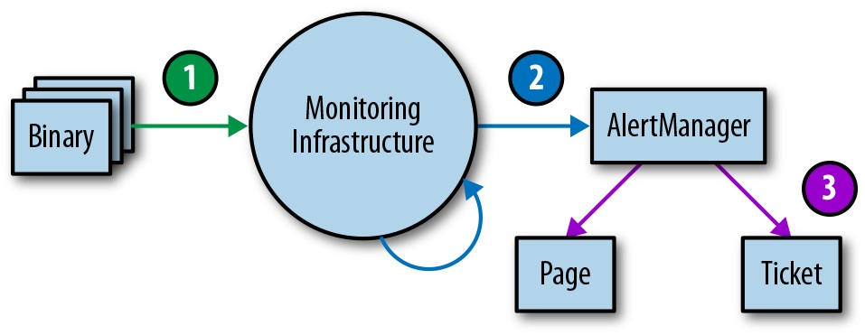

# **第4章**

### **监控**

<br/>

***由Jess Frame，Anthony Lenton，Steven Thurgood***

***安东·托尔恰诺夫(Anton Tolchanov)和内伊·特金(Nejt Trdin)与卡梅拉·奎尼托(Carmela Quinito)提供***

<br/>
<br/>


监控可以包括许多类型的数据，包括指标，文本日志记录，结构化事件日志记录，分布式跟踪和事件自省。尽管所有这些方法本身都是有用的，但本章主要介绍度量标准和结构化日志记录。根据我们的经验，这两个数据源最适合SRE的基本监控需求。

在最基本的级别上，监控使您能够了解系统，这是判断服务运行状况并在出现问题时诊断服务的核心要求。[SRE第一本书中的[第6章]](http://bit.ly/2KNCD9F)提供了一些基本的监控定义，并说明了SRE监控其系统以: 

- 提醒需要注意的条件。

- 调查并诊断这些问题。

- 直观显示有关系统的信息。

- 深入了解资源使用或服务运行状况的趋势以进行长期规划。

- 比较更改前后，或实验中两组之间系统的行为。

这些用例的相对重要性可能会导致您在选择或构建监控系统时进行权衡。

本章讨论了Google如何管理监控系统，并提供了一些准则，以指导您选择和运行监控系统时可能出现的问题。

## **监控策略的理想功能**

选择监控系统时，重要的是要了解和优先考虑与您相关的功能。如果您要评估不同的监控系统，则本节中的属性可以帮助指导您思考哪种解决方案最适合您的需求。如果已经有了监控策略，则可以考虑使用当前解决方案的其他一些功能。取决于您的需求，单一监控系统可以解决您的所有用例，或者您可能希望使用多个系统的组合。

### **速度**

在"数据的新鲜度"和"数据检索的速度"方面，不同的组织会有不同的需求。

数据应在需要时可用: 刷新会影响出现问题时监控系统分页的时间。此外，缓慢的数据可能会导致您意外地对不正确的数据进行操作。例如，在事件响应期间，如果原因(采取措施)与结果(看到您的监控反映了该措施)之间的时间太长，则您可能会认为更改没有效果，或者推断出因果之间存在错误的关联。失效时间超过四到五分钟的数据可能会严重影响您对事件做出响应的速度。

如果要基于此条件选择监控系统，则需要提前弄清速度要求。查询大量数据时，数据检索的速度通常是一个问题。如果图形必须汇总来自许多受监控系统的大量数据，则可能需要花费一些时间来加载图形。为了加快速度较慢的图形的速度，如果监控系统可以根据传入的数据创建和存储新的时间序列，将很有帮助；然后就可以预先计算常见查询的答案。

### **计算**

对计算的支持可以跨越各种复杂性的各种用例。至少，您可能希望您的系统"保留多个月时间范围内的数据"。如果没有长期的数据视图，就无法分析诸如系统增长之类的长期趋势。就粒度而言，*摘要数据*(即您无法深入研究的汇总数据)足以促进增长计划。*保留所有详细的个人指标*可能有助于回答以下问题: "以前是否发生过这种异常行为？"但是，数据存储起来可能很昂贵，或者检索起来不切实际。

理想情况下，您保留的有关事件或资源消耗的指标应该是单调递增的计数器。使用计数器，您的监控系统可以计算一段时间内的窗口化功能，例如，报告该计数器每秒的请求速率。在更长的时间范围内(最多一个月)计算这些费率，可以实现基于SLO消耗的警报的构建基块(请参阅第5章)。

最后，支持更全面的统计功能可能很有用，因为琐碎的操作可能掩盖不良行为。一个在记录延迟时支持计算百分数(例如50%、95%、99%百分数)的监控系统将使您看到是否请求的50％，5％或1％太慢，而算术平均值只能告诉您请求时间较慢--没有具体说明。或者，如果您的系统不直接支持计算百分数，则可以通过以下方法实现: 

- 通过将请求中花费的秒数相加并除以请求数得出平均值

- 记录每个请求并通过扫描或采样日志条目来计算百分比值

您可能希望将原始指标数据记录在一个单独的系统中以进行脱机分析-例如，用于每周或每月报告中，或者执行更复杂的计算，而这些计算在监控系统中很难计算。

### **接口**

强大的监控系统应使您可以在图表中简洁地显示时间序列数据，并在表格或一系列图表样式中构造数据。仪表板将成为显示监控的主要界面，因此，选择最清楚显示所需数据的格式非常重要。一些选项包括热图，直方图和对数比例图。

您可能需要根据受众群体提供相同数据的不同视图；高级管理层可能希望查看与SRE完全不同的信息。具体说明如何创建对使用内容的人有意义的仪表板。对于每组仪表板，始终如一地显示相同类型的数据对于进行通信很有价值。

您可能需要实时绘制跨度量的不同聚合的信息，例如计算机类型，服务器版本或请求类型。对您的团队来说，最好是对数据进行临时的深入研究。通过


根据各种指标对数据进行切片，可以在需要时查找数据中的相关性和模式。

### **警报**

能够对警报进行分类很有帮助: 警报的多种类别允许按比例响应。为不同的警报设置不同的严重性级别的功能也很有用: 您可以提交故障单以调查持续一个多小时的低错误率，而100％的错误率是紧急情况，应立即采取措施。

*警报抑制*功能使您避免不必要的噪音分散On-Call工程师的注意力。例如: 

- 当所有节点都经历相同的高错误率时，您可以针对全局错误率仅发出一次警报，而不是为每个节点发送单独的警报。

- 当您的服务依赖项之一具有触发警报(例如，后端速度缓慢)时，您无需为服务的错误率发出警报。

您还需要确保事件结束后不再抑制警报。

您对系统所需的控制级别将决定您使用第三方监控服务还是部署并运行自己的监控系统。Google内部开发了自己的监控系统，但是有大量的开源和商业监控系统可用。

## **监控数据来源**

您选择的监控系统将由您将使用的特定监控数据源来通知。本节讨论两种常见的监控数据源: 日志和度量。还有其他一些有价值的监控资源，例如[分布式跟踪](http://bit.ly/2syvpOw)和运行时内省，我们在这里将不介绍。

*度量*是代表属性和事件的数值度量，通常是通过多个数据点以固定的时间间隔收集的。*日志*是事件的仅追加记录。本章的讨论重点在于结构化日志，该结构化日志启用了丰富的查询和聚合工具，而不是纯文本日志。

Google的基于日志的系统处理大量的高度精细的数据。在事件发生和在日志中可见之间存在固有的延迟。对于不敏感的分析，可以使用批处理系统处理这些日志，可以使用临时查询对其进行查询，并可以使用仪表板对其进行可视化。此工作流程的一个示例是使用[Cloud Dataflow](https://cloud.google.com/dataflow/)处理日志，并使用[BigQuery](https://cloud.google.com/bigquery/)临时查询和[Data Studio](https://datastudio.google.com/)来获取信息中心。

相比之下，我们基于指标的监控系统从Google的每项服务中收集了大量指标，但提供的粒度信息要少得多，但几乎是实时的。这些特性在其他基于日志和基于指标的监控系统中是相当典型的，尽管有例外，例如实时日志系统或高基数指标。

我们的警报和仪表板通常使用指标。我们基于指标的监控系统的实时性意味着可以非常迅速地将问题通知工程师。我们倾向于使用日志来查找问题的根本原因，因为我们经常无法获得所需的信息。

当报告对时间不敏感时，我们经常使用日志处理系统生成详细的报告，因为日志几乎总是比指标产生更准确的数据。

如果您基于指标进行警报，则可能很想根据日志添加更多警报，例如，即使在发生单个异常事件时也需要通知您。在这种情况下，我们仍然建议基于指标的警报: 您可以在发生特定事件时增加计数器指标，并根据该指标的值配置警报。该策略将所有警报配置都放在一个位置，使管理起来更加容易(请参阅第67页的"管理监控系统")。

### **例子**

以下真实示例说明了如何在监控系统之间进行选择的过程中进行推理。

**将信息从日志移至指标**

**问题.** HTTP状态代码是向App Engine客户调试错误的重要信号。该信息在日志中可用，但在指标中不可用。指标仪表板只能提供所有错误的全局比率，并且不包括有关确切错误代码或错误原因的任何信息。结果，调试问题的工作流程涉及: 

1. 查看全局错误图以查找发生错误的时间。

2. 读取日志文件以查找包含错误的行。

3. 尝试将日志文件中的错误与图表相关联。

日志记录工具没有给出规模感，因此很难知道是否在一个日志行中经常发生错误。日志还包含许多其他不相关的行，因此很难找到根本原因。


**建议的解决方案.** App Engine开发人员团队选择将HTTP状态代码导出为指标上的标签(例如，requests_total{status=404}与requests_total{status=500})。因为不同的HTTP状态代码的数量相对有限，所以这并未将度量标准数据的数量增加到不切实际的大小，而是使最相关的数据可用于图形化和警报。

**结果.** 这个新标签意味着团队可以升级图形以针对不同的错误类别和类型显示单独的行。客户现在可以根据暴露的错误代码快速地对可能的问题进行推测。现在，我们还可以为客户端和服务器错误设置不同的警报阈值，从而使警报触发更为准确。

**改善日志和指标**

**问题.** 一个Ads SRE团队维护了约50项服务，这些服务是用多种不同的语言和框架编写的。团队使用日志作为SLO合规性的标准真实来源。为了计算错误预算，每个服务都使用了日志处理脚本，其中包含许多特定于服务的特殊情况。这是处理单个服务的日志条目的示例脚本: 

```
If the HTTP status code was in the range (500, 599)
    AND the 'SERVER ERROR' field of the log is populated
    AND DEBUG cookie was not set as part of the request
    AND the url did not contain '/reports'
AND the 'exception' field did not contain 'com.google.ads.PasswordException' THEN increment the error counter by 1
```

这些脚本难以维护，并且还使用了基于指标的监控系统无法使用的数据。因为度量标准驱动了警报，所以有时警报不会对应于面向用户的错误。每个警报都需要一个明确的分类步骤来确定它是否面向用户，这减慢了响应时间。

**建议的解决方案.** 该团队创建了一个库，该库与每个应用程序的框架语言的逻辑息息相关。该库确定该错误是否在请求时影响了用户。工具将这个决定记录在日志中，并同时将其导出为指标，以提高一致性。如果度量标准表明服务已返回错误，则日志中将包含确切的错误以及与请求相关的数据，以帮助重现和调试问题。相应地，日志中出现的任何影响SLO的错误也会更改SLI指标，然后团队可以对其进行警报。

**结果.** 通过跨多个服务引入统一的控制界面，该团队重用了工具和警报逻辑，而不是实施多个自定义解决方案。移除复杂的，特定于服务的日志处理代码后，所有服务都因此受益，从而提高了可伸缩性。将警报直接与SLO绑定在一起后，它们就可以更明确地采取行动，因此，误报率显着降低。

**保留日志作为数据源**

**问题.** 在调查生产问题时，一个SRE团队通常会查看受影响的实体ID，以确定用户影响和根本原因。与之前的App Engine示例一样，此调查需要的数据仅在日志中可用。该团队在响应事件时必须对此执行一次性日志查询。此步骤增加了事件恢复的时间: 几分钟可以正确组合查询，还有查询日志的时间。

**建议的解决方案** 团队最初讨论了指标是否应替换其日志工具。与App Engine示例不同，实体ID可以采用数百万个不同的值，因此它不适合用作指标标签。

最终，团队决定编写一个脚本来执行他们需要的一次性日志查询，并记录下要在警报电子邮件中运行的脚本。然后，如有必要，他们可以将命令直接复制到终端中。

**结果.** 团队不再承担管理正确的一次性日志查询的认知负担。因此，他们可以更快地获得所需的结果(尽管不如基于指标的方法那样快)。他们还有一个备份计划: 警报触发后，他们可以自动运行脚本，并使用小型服务器定期查询日志以不断检索半新数据。

## **管理您的监控系统**

您的监控系统与您运行的任何其他服务一样重要。因此，应给予适当程度的护理和关注。**以代码形式处理您的配置**

将系统配置视为代码并将其存储在版本控制系统中是常见的做法，它们提供了一些明显的好处: 更改历史记录，从特定更改到任务跟踪系统的链接，更容易的回滚和棉签检查，[^33]以及强制执行的代码审查程序。

我们强烈建议还将监控配置视为代码(有关配置的更多信息，请参见第14章)。与仅提供Web UI或[CRUD样式](http://bit.ly/1G4WdV1)API的系统相比，支持基于意图的配置的监控系统更为可取。对于许多仅读取配置文件的开源二进制文件，此配置方法是标准的。一些第三方解决方案，例如[grafanalib](http://bit.ly/2so5Wrx)，可为传统上使用UI配置的组件启用此方法。

### **鼓励一致性**

拥有多个使用监控功能的工程团队的大型公司需要达到一个很好的平衡: 集中式方法可以提供一致性，但是另一方面，各个团队可能希望完全控制其配置的设计。正确的解决方案取决于您的组织。随着时间的流逝，Google的方法已朝着集中在作为服务集中运行的单个框架上发展。由于一些原因，该解决方案对我们来说效果很好。单个框架使工程师在切换团队时能够更快地提高工作效率，并使调试过程中的协作更加轻松。我们还提供集中式仪表板服务，每个团队的仪表板都是可发现和可访问的。如果您容易理解另一个团队的仪表板，则可以更快地调试问题。

如果可能的话，使基本的监控范围不费吹灰之力。如果您所有的服务[^34]都导出了一致的基本指标集，则可以在整个组织中自动收集这些指标并提供一致的仪表板集。这种方法意味着您自动启动的任何新组件都具有基本监控。公司中的许多团队(甚至是非工程团队)也可以使用此监控数据。

**首选松散耦合**

业务需求发生变化，并且您的生产系统从现在开始一年后将有所不同。同样，您的监控系统也需要随着时间的推移而发展，因为它所监控的服务会通过不同的故障模式而发展。

我们建议使监控系统的组件保持松散耦合。您应该具有用于配置每个组件和传递监控数据的稳定接口。单独的组件应负责收集，存储，警告和可视化监控。稳定的接口可以更轻松地交换任何给定的组件，以获得更好的替代方案。

将功能拆分为单个组件在开源世界中正变得越来越流行。十年前，诸如[Zabbix](https://www.zabbix.com/)之类的监控系统将所有功能组合为一个组件。现代设计通常涉及到将收集和规则评估分开(使用诸如[Prometheus服务器](https://prometheus.io/)之类的解决方案)，长期时间序列存储([InfluxDB](https://www.influxdata.com/))，警报汇总([Alertmanager](http://bit.ly/2soB22b))和仪表板([Grafana](https://grafana.com/))。

在撰写本文时，至少有两种流行的开放标准可用于对软件进行检测和公开指标: 

[*statsd*](https://github.com/etsy/statsd)

> 度量标准聚合守护程序最初由Etsy编写，现在已移植到大多数编程语言中。

*Prometheus*

> 开源监控解决方案，具有灵活的数据模型，支持度量标准标签和强大的直方图功能。其他系统现在正在采用Prometheus格式，并且已标准化为[OpenMetrics](https://openmetrics.io/)。

可以使用多个数据源的单独的仪表板系统提供了服务的集中统一概述。Google最近在实践中看到了这一好处: 我们的旧版监控系统(Borgmon [^35])在与警报规则相同的配置下组合了仪表板。在迁移到新系统([Monarch)](https://youtu.be/LlvJdK1xsl4)时，我们决定将仪表板移至单独的服务([Viceroy)](http://bit.ly/2sqRwad)。由于Viceroy不是Borgmon或Monarch的组成部分，因此Monarch的功能需求较少。由于用户可以使用Viceroy基于来自两个监控系统的数据显示图形，因此他们可以逐渐从Borgmon迁移到Monarch。

## **目的指标**

第5章介绍了如何在系统的错误预算受到威胁时使用SLI指标进行监控和警报。SLI指标是基于SLO的警报触发时要检查的第一个指标。这些指标应显着显示在服务的仪表板中，最好在其目标页面上。

在调查违反SLO的原因时，您很可能不会从SLO仪表板获得足够的信息。这些仪表板表明您违反了SLO，但不一定要这样做。监控仪表板还应显示哪些其他数据？

我们发现以下准则有助于实施指标。这些指标应提供合理的监控，使您能够调查生产问题，并提供有关服务的广泛信息。

### **预期的变化**

诊断基于SLO的警报时，您需要能够从通知您有关用户影响问题的警报指标转变为告诉您是什么引起这些问题的指标。最近打算对服务进行的更改可能有误。添加监控以通知您生产中的任何变化。[^36]要确定触发器，我们建议以下操作: 

- 监控二进制文件的版本。

- 监控命令行标志，尤其是在使用这些标志启用和禁用服务功能时。

- 如果将配置数据动态推送到您的服务，请监控此动态配置的版本。

如果未对系统的任何这些版本进行版本控制，则您应该能够监控上次构建或打包该系统的时间戳。

当您尝试将中断与部署相关联时，查看警报中链接的图形/仪表板比事后浏览CI/CD(持续集成/持续交付)系统日志要容易得多。

### **依赖**

即使您的服务没有更改，其任何依赖关系也可能会更改或出现问题，因此您还应该监控来自直接依赖关系的响应。

导出每个依赖项的请求和响应大小(以字节，等待时间和响应代码为单位)是合理的。选择要绘制图形的度量时，请记住四个[黄金信号](http://bit.ly/2LSLpDQ)。您可以在指标上使用其他标签，以按响应代码，RPC(远程过程调用)方法名称和对等作业名称对它们进行分类。

理想情况下，您可以检测较低级别的RPC客户端库以一次导出这些指标，而不是要求每个RPC客户端库将其导出。[^37]检测客户端库可提供更高的一致性，并允许您免费监控新的依赖项。

有时您会遇到提供非常狭窄的API的依赖项，其中所有功能都可以通过名为*Get*，*Query*或同等无益的单个RPC来使用，并且实际命令被指定为该RPC的参数。客户端库中的单个检测点缺乏这种类型的依赖关系: 您将观察到时延的巨大差异以及一定百分比的错误，这些错误可能表示也可能不表示此不透明API的某些部分完全失败。如果此依赖关系很关键，则有两种方法可以很好地监控它: 

- 导出单独的度量标准以适应依赖性，以便度量标准可以解包收到的请求以获取实际信号。

- 要求该依赖所有者执行重写以导出更广泛的API，该API支持在单独的RPC服务和方法之间划分的单独功能。

**饱和**

旨在监控和跟踪服务所依赖的每种资源的使用情况。某些资源具有您不能超过的硬限制，例如分配给应用程序的RAM，磁盘或CPU配额。其他资源-例如打开文件描述符，任何线程池中的活动线程，队列中的等待时间或书面日志的数量-可能没有明确的硬限制，但仍需要管理。

根据所使用的编程语言，您应该监控其他资源: 

- 在Java中: 堆和[元空间](http://bit.ly/2J9g3Ha)的大小，以及更具体的指标，具体取决于您使用的垃圾收集类型

- 在Golang中: goroutine的数量

语言本身为跟踪这些资源提供了各种支持。

除了按第5章中所述对重大事件进行警报外，您还可能需要设置在耗尽特定资源时将触发的警报，例如: 

- 当资源有硬限制时

- 超过使用量阈值会导致性能下降

您应该具有监控指标来跟踪所有资源，甚至是服务管理良好的资源。这些指标对于容量和资源规划至关重要。

### **服务流量状态**

最好添加指标或指标标签，以允许仪表板按状态代码细分服务流量(除非您的服务用于SLI的指标已包含此信息)。以下是一些建议: 

- 对于HTTP流量，请监控所有响应代码，即使它们没有提供足够的警报信号，因为某些响应代码可能是由错误的客户端行为触发的。

- 如果您对用户应用速率限制或配额限制，请监控由于配额不足而拒绝的请求总数。

这些数据的图形可以帮助您确定在生产变更期间错误量何时发生明显变化。

### **实施有目的的指标**

每个暴露的指标都应达到目的。抵制仅因易于生成而导出少量指标的诱惑。相反，请考虑如何使用这些指标。指标设计或缺乏指标设计太含蓄。

理想情况下，用于警报的度量标准值仅在系统进入问题状态时才发生重大变化，而在系统正常运行时则不会发生变化。另一方面，调试指标不具有这些要求-它们旨在提供有关警报触发时正在发生的情况的见解。良好的调试指标将指向可能导致问题的系统某些方面。撰写事后评估时，请考虑可以使用哪些其他指标更快地诊断问题。

### **测试警报逻辑**

在理想的情况下，监控和警报代码应遵循与代码开发相同的测试标准。虽然Prometheus开发人员正在[讨论开发用于监控的单元测试](http://bit.ly/2JcobXe)，但目前尚没有广泛采用的系统可以执行此操作。

在Google，我们使用特定于域的语言来测试我们的监控和警报，该语言允许我们创建综合时间序列。然后，我们根据派生的时间序列中的值或特定警报的触发状态和标签存在情况来编写断言。

监控和警报通常是一个多阶段的过程，因此需要多个系列的单元测试。尽管该领域仍很不发达，但是如果您想在某个时候实施监控测试，我们建议采用三层方法，如图4-1所示。

>

*图4-1.监控测试环境层*

1. **二进制报告:** 检查导出的度量变量在某些条件下是否按预期变化。

2. **监控配置:** 确保规则评估产生预期结果，并且特定条件产生预期警报。

3. **允许的配置:** 根据警报标签值测试是否将生成的警报路由到预定的目的地。

如果您无法通过综合手段来测试监控，或者某个阶段您根本无法测试，请考虑创建一个正在运行的系统，该系统可以导出众所周知的指标，例如请求数和错误数。您可以使用此系统来验证派生的时间序列和警报。您的警报规则很可能在您配置警报规则后的几个月或几年内不会触发，并且您需要确信，当指标超过特定阈值时，将会向有意义的工程师发出有意义的通知。

## **结论**

由于SRE角色负责生产中系统的可靠性，因此经常需要SRE熟悉服务的监控系统及其功能。没有这些知识，SRE可能不知道在何处看待，如何识别异常行为或如何在紧急情况找到他们需要的信息。

我们希望通过指出我们发现有用的监控系统功能以及原因，可以帮助您评估监控策略满足您的需求的程度，探索您可能能够利用的其他功能以及考虑可能要进行的更改。您可能会发现将一些度量标准来源和日志记录结合到监控策略中很有用；您需要的确切组合在很大程度上取决于上下文。确保收集用于特定目的的指标。该目的可能是为了更好地进行容量规划，协助调试或直接将问题通知您。


监控到位后，它必须可见且有用。为此，我们还建议您测试监控设置。一个好的监控系统可以带来好处。值得进行大量投资，以深入思考哪种解决方案最能满足您的需求，并进行迭代直到您找到正确的解决方案。