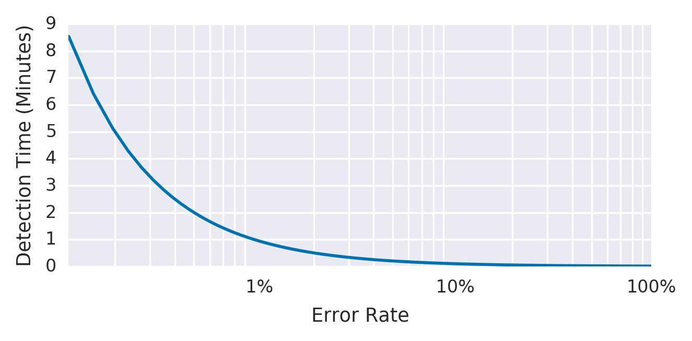
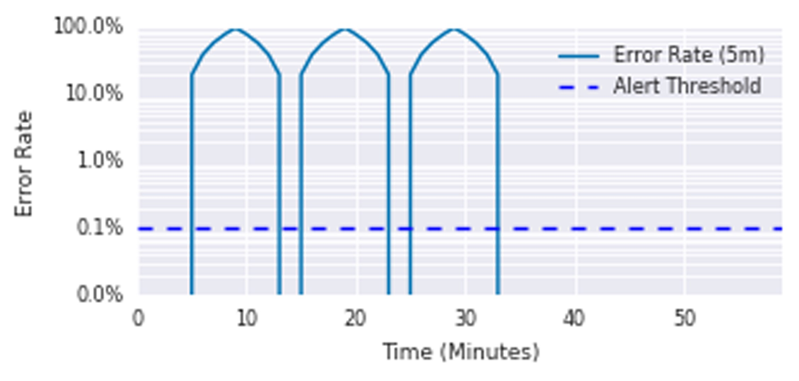
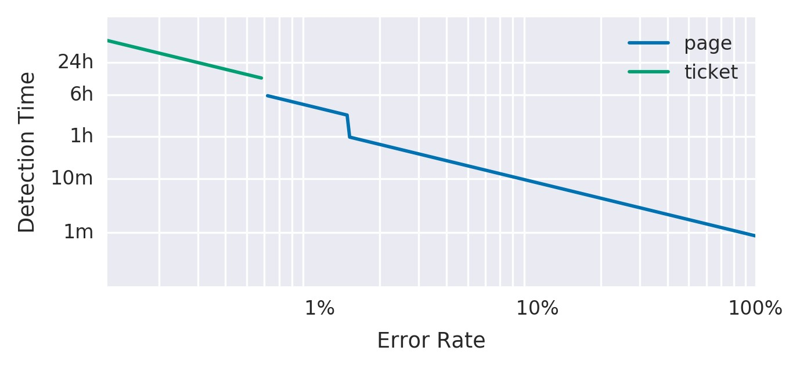
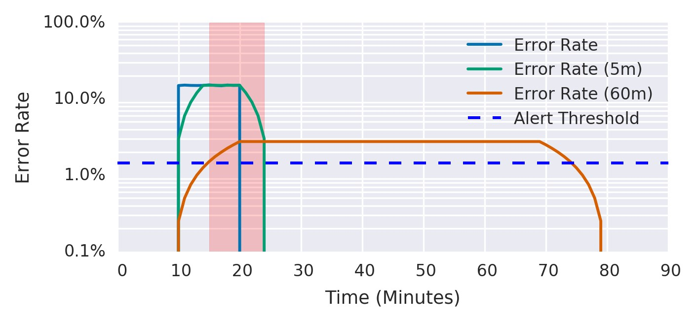

# **第5章**

### **基于SLO报警**

<br/>

***由史蒂文·瑟古德***

***与Jess Frame，Anthony Lenton，Carmela Quinito，Anton Tolchanov和Nejc Trdin撰写***

<br/>
<br/>

本章说明如何在重大事件上将SLO变成可操作的警报。我们的[第一本SRE书](http://bit.ly/2kIcNYM)和这本书都谈到了实现SLO。我们相信，拥有良好的SLO(可以衡量您的平台的可靠性)，如客户所体验到的那样，可以为呼叫工程师何时响应提供最高质量的指示。在这里，我们提供了有关如何将这些SLO转换为警报规则的具体指导，以便您可以在消耗过多错误预算之前对问题进行响应。

我们的示例介绍了一系列用于度量指标和逻辑警报的日益复杂的实现。我们讨论了它们的效用和缺点。尽管我们的示例使用了简单的请求驱动服务和[Prometheus语法](https://prometheus.io/)，但是您可以在任何警报框架中应用此方法。

## **注意事项**

为了从服务水平指示器(SLI)和错误预算生成警报，您需要一种将这两个元素组合为特定规则的方法。您的目标是收到*重要事件*的通知: 重大事件消耗了错误预算的大部分。

评估警报策略时，请考虑以下属性: 

*精确*

> 检测到的重大事件的比例。如果每个警报都对应一个重大事件，则精度为100％。请注意，在低流量时段，警报可能对不重要的事件特别敏感(在第86页的“低流量服务和错误预算警报”中进行了讨论)。

*召回*

> 检测到的重大事件的比例。如果每个重大事件都导致警报，则召回率为100％。

*检测时间*

> 在各种情况下发送通知需要多长时间。较长的检测时间会对错误预算产生负面影响。

*重置时间*

> 解决问题后，警报触发多长时间。较长的重置时间可能导致混乱或问题被忽略。

## **重要事件提醒方式**

为您的SLO构造警报规则可能会变得非常复杂。在这里，我们介绍了六种方法，以提高保真度的顺序配置对重大事件的警报，以提供一个选项，可以同时对精度，调用，检测时间和重置时间这四个参数进行良好控制。以下每种方法都可以解决一个不同的问题，并且某些方法最终可以同时解决多个问题。前三种不可行的尝试朝着后三种可行的警报策略迈进，方法6是最可行和最推荐的选择。第一种方法易于实施，但不足，而最佳方法则可以为长期和短期内的SLO防御提供完整的解决方案。

在此讨论中，“错误预算”和“错误率”适用于所有SLI，而不仅仅是名称上带有“错误”的SLI。在“要测量的内容”部分中: 第20页上的“使用SLI”，我们建议使用SLI来捕获好事件与总事件的比率。错误预算给出了允许的不良事件的数量，错误率是不良事件与总事件的比率。

### **1: 目标错误率≥SLO阈值**

对于最简单的解决方案，您可以选择一个较小的时间窗口(例如10分钟)，并在该时间窗口的错误率超过SLO时发出警报。

例如，如果30天的SLO为99.9％，则在过去10分钟内的错误率≥0.1％时发出警报: 

```
- alert: HighErrorRate
expr: job:slo_errors_per_request:ratio_rate10m{job="myjob"} >= 0.001
```

在Prometheus中使用记录规则计算得出的这10分钟平均值: 

```
record: job:slo_errors_per_request:ratio_rate10m expr:
sum(rate(slo_errors[10m])) by (job) /
sum(rate(slo_requests[10m])) by (job)
``` 


如果您不从工作中导出slo_errors和slo_requests，则可以通过重命名指标来创建时间序列: 
```
record: slo_errors
expr: http_errors
```


当最近的错误率等于SLO时发出警报意味着系统检测到以下预算支出: 

```
(alerting window size) / (reporting period)
```


图5-1显示了具有10分钟警报窗口和99.9％SLO的示例服务的检测时间与错误率之间的关系。

>

*图5-1.具有10分钟警报窗口和99.9％SLO的示例服务的检测时间*

表5-1显示了即时错误率过高时发出警报的优点和缺点。

*表5-1.当即时错误率过高时发出警报的利弊*

| **优点** | **缺点** |
| --- | --- |
| 检测时间好: 完全中断0.6秒。|精度低: 该警报在许多不会威胁到SLO的事件上触发。10分钟内0.1％的错误率会发出警报，而*仅消耗每月错误预算的0.02％.*|
| 此警报会在威胁到SLO的任何事件时触发，显示出良好的召回效果。|举个例子，您每天可能最多收到144条警报，不对任何警报采取行动，并且仍然符合SLO。|


### **2: 警报窗口增加**

我们可以通过更改警报窗口的大小来提高精度，以此为基础。通过增加窗口大小，您将在触发警报之前花费更高的预算金额。

为了保持[可管理的警报率](http://bit.ly/2LQYspl)，您决定仅在事件消耗了30天错误预算的5％(36小时的窗口)时才收到通知: 

```
- alert: HighErrorRate
    expr: job:slo_errors_per_request:ratio_rate36h{job="myjob"} > 0.001
```

现在，检测时间为: 

```
(1 − SLO) / (error ratio) × alerting window size
```

表5-2显示了在较大的时间范围内错误率过高时发出警报的优点和缺点。

*表5-2.在较大的时间范围内错误率过高时发出警报的利弊*

| **优点** | **缺点** |
| --- | --- |
| 检测时间还是不错的: 2分钟10秒完全中断。                                                                                                 |重置时间很差: 在100％中断的情况下，警报会在2分钟后立即触发，并在接下来的36小时内继续触发。|
| 比前面的示例更好的精度: 通过确保错误率持续更长的时间，警报很可能对错误预算构成严重威胁。|由于存在大量数据点，因此在更长的窗口中计算速率在内存或I/O操作方面可能会非常昂贵。 |


图5-2显示，尽管36小时内的错误率已降至可以忽略的水平，但36小时平均错误率仍高于阈值。

>

*图5-2.36小时内的错误率*

### **3: 递增警报持续时间**

大多数监控系统都允许您将持续时间参数添加到警报条件，因此除非该值在一段时间内保持高于阈值，否则不会触发警报。您可能会想将此参数用作添加较长窗口的相对便宜的方法: 

```
- alert: HighErrorRate
    expr: job:slo_errors_per_request:ratio_rate1m{job="myjob"} > 0.001 for: 1h
```

表5-3显示了使用持续时间参数进行警报的优缺点。

*表5-3.使用持续时间参数发出警报的利弊*


| **优点** | **缺点** |
| --- | --- |
| 警报可以更高精度。|召回不良和检测时间差: 由于持续时间不随事件的严重性而定，因此一小时后会发出100％的停机警报，而检测时间与0.2％的停机时间相同。100％的停机将消耗该小时30天预算的140％。|
| 在触发之前要求持续的错误率意味着警报更有可能对应于重大事件。|如果度量标准甚至立即恢复到SLO内的水平，则持续时间计时器将重置。在丢失的SLO和通过的SLO之间波动的SLI可能永远不会发出警报。  |


由于表5-3中列出的原因，我们不建议将持续时间用作基于SLO的警报条件的一部分。[^38]

图5-3显示了具有以下条件的服务在5分钟内的平均错误率: 

警报触发前10分钟。每10分钟持续5分钟的一系列100％错误峰值，即使消耗了35％的错误预算，也永远不会触发警报。

>


*图5-3.每10分钟出现100％错误峰值的服务*

每个高峰都消耗了30天预算的近12％，但警报从未触发。

### **4: 消耗速率警报**

为了改进先前的解决方案，您想要创建具有良好检测时间和高精度的警报。为此，您可以引入消耗率以减小窗口大小，同时保持警报预算支出不变。

*消耗速率*是相对于SLO，服务消耗错误预算的速度。图5-4显示了消耗率和错误预算之间的关系。

该示例服务使用1的消耗率，这意味着它消耗错误预算的速率使得在SLO时间窗口结束时，您的预算恰好为零(请参阅[第4章](http://bit.ly/ 2szBKsK))。在30天的时间范围内，如果SLO为99.9％，则恒定的0.1％错误率将使用所有错误预算: 消耗率为1。

>

*图5-4.相对于消耗率的错误预算*

表5-4显示了消耗率，其相应的错误率以及用尽SLO预算所需的时间。

*表5-4.完成预算用尽的消耗率和时间*

| **消耗率** | **99.9％SLO的错误率** | **消耗时间** |
| --- | ---| --- |
| 1 | 0.1％| 30天|
| 2 | 0.2%| 15天|
| 10 | 1％| 3天|
| 1,000 | 100％| 43分钟|

通过将警报窗口固定为一小时，并确定5％的错误预算支出足以通知某人，您可以得出要用于警报的消耗率。

对于基于消耗率的警报，触发警报所需的时间为: 

```
(1 − SLO) / (error ratio) × alerting window size × burn rate
```

警报触发时消耗的错误预算为: 

```
burn rate × alerting window size / period
```

一小时内花费30天的错误预算的5％，需要的消耗率为36。现在，警报规则变为: 

```
- alert: HighErrorRate
    expr: job:slo_errors_per_request:ratio_rate1h{job="myjob"} > 36 * 0.001
```

*表5-5.基于消耗率的警报的利弊*


| **优点** | **缺点** |
| --- | --- |
| 精度好: 该策略选择了错误预算支出的重要部分来提醒。|召回率低: 35倍的消耗速度永远不会发出警报，但会在20.5小时内消耗掉30天的所有错误预算。|
| 时间窗口更短，计算起来更便宜。 |重置时间: 58分钟仍然太长。|
| 良好的检测时间。| |
| 更好的重置时间: 58分钟。 | |


### **5: 多个消耗速率警报**

您的警报逻辑可以使用多个消耗率和时间窗口，并在消耗率超过指定阈值时发出警报。此选项保留了警告消耗率的好处，并确保您不会忽略较低(但仍然很重要)的错误率。

为通常不会引起注意的事件设置故障单通知也是一个好主意，但是如果不加以检查会耗尽您的错误预算-例如，三天内预算消耗为10％。该错误率捕获了重大事件，但是由于预算消耗率为解决该事件提供了足够的时间，因此您无需寻呼某人。

我们建议一小时内2％的预算消耗和六小时内5％的预算消耗，作为合理的寻呼起始编号，三天之内将10％的预算消耗作为故障通知的良好基准。适当的数字取决于服务和基准页面负载。为了获得更繁忙的服务，并且根据周末和节假日的On-Call职责，您可能希望在六小时窗口内收到故障单警报。

表5-6显示了消耗的SLO预算百分比的相应消耗率和时间窗口。

*表5-6.建议的时间窗口和消耗率，用于消耗的SLO预算的百分比*


| **SLO预算消耗** | **时间窗口** | **消耗率** | **通知** |
| --- | --- | --- | --- |
| 2％| 1小时|14.4 |呼叫|
| 5％| 6小时|6 |呼叫|
| 10％| 3天| 1 |工单|

警报配置可能类似于: 

```
expr: (
    job:slo_errors_per_request:ratio_rate1h{job="myjob"} > (14.4*0.001)
    or
    job:slo_errors_per_request:ratio_rate6h{job="myjob"} > (6*0.001)
    )
severity: page
expr: job:slo_errors_per_request:ratio_rate3d{job="myjob"} > 0.001 severity: ticket
```

图5-5根据错误率显示了检测时间和警报类型。

>

*图5-5.错误率，检测时间和警报通知*

多种消耗速率使您可以根据警报的响应速度来调整警报，使其具有适当的优先级。如果问题会在几个小时或几天内耗尽错误预算，则发送活动通知是适当的。否则，基于故障单的通知在下一个工作日处理警报更为合适。[^39]表5-7列出了使用多种消耗率的优缺点。

*表5-7.使用多种消耗速率的优缺点*


| **优点** | **缺点** |
| --- | --- |
|能够根据紧急情况使监控配置适应多种情况: 如果错误率很高，则迅速发出警报；如果错误率较低但持续存在，则最终发出警报。|更多数字，窗口大小以及要管理和推理的阈值。|
|与所有固定预算部分警报方法一样，精度很高。|为期三天的窗口会导致更长的重置时间。为了避免在所有条件都满足的情况下触发多个警报，您需要实施警报抑制。例如: 五分钟内支出10％的预算也意味着六小时内支出了5％的预算，一小时内支出了2％的预算。除非监控系统足够智能以阻止其运行，否则此方案将触发三个通知。|
|好的召回，因为该窗口为期三天。| |
|根据某人为捍卫SLO做出反应的速度来选择最合适的警报类型。| |


### **6: 多窗口，多消耗率警报**

我们可以在第5次迭代中增强多消耗率警报，以便仅在我们仍“还在”积极消耗预算时通知我们-从而减少误报的数量。为此，我们需要添加另一个参数: 一个较短的窗口，以检查触发警报时是否仍在使用错误预算。

一个好的指导原则是使短窗口的时间为长窗口的持续时间的1/12，如图5-6所示。该图显示了两个警报阈值。在经历15％的错误10分钟后，短窗口平均值立即超过警报阈值，而长窗口平均值在5分钟后超过阈值，此时警报开始触发。错误停止5分钟后，短窗口平均值下降到阈值以下，此时警报停止触发。错误停止60分钟后，长窗平均值下降到阈值以下。

>

*图5-6.短窗口和长警报窗口*

例如，当您在前一小时和前五分钟内的消耗速度超过14.4倍时，可以发送页面级警报。仅当您用完预算的2％时才会触发此警报，但是通过在五分钟后而不是一小时后停止触发，可以显示更好的重置时间: 

```
expr: (
job:slo_errors_per_request:ratio_rate1h{job="myjob"} > (14.4*0.001)
and
job:slo_errors_per_request:ratio_rate5m{job="myjob"} > (14.4*0.001)
) or
(
job:slo_errors_per_request:ratio_rate6h{job="myjob"} > (6*0.001)
and
job:slo_errors_per_request:ratio_rate30m{job="myjob"} > (6*0.001)
          )
    severity: page
expr: (
job:slo_errors_per_request:ratio_rate24h{job="myjob"} > (3*0.001)
and
job:slo_errors_per_request:ratio_rate2h{job="myjob"} > (3*0.001)
) or
(
job:slo_errors_per_request:ratio_rate3d{job="myjob"} > 0.001
and
job:slo_errors_per_request:ratio_rate6h{job="myjob"} > 0.001
          )
    severity: ticket
```

我们建议将表5-8中列出的参数作为基于SLO的警报配置的起点。

*表5-8.99.9％SLO警报配置的推荐参数*


| **严重程度** | **长期窗口** | **短期窗口** | **消耗率** | **消耗的错误预算** |
| ---| --- | --- | --- | --- |
| 呼叫| 1小时|5分钟|14.4 | 2％|
| 呼叫| 6小时|30分钟| 6 | 5％|
| 故障单| 3天| 6小时|1 | 10％|


我们发现基于多种消耗速率的警报是实施基于SLO的警报的有效方法。

表5-9显示了使用多个消耗速率和窗口大小的好处和局限性。

*表5-9.使用多种消耗速率和窗口大小的优缺点*


| **优点** | **缺点** |
| --- | --- |
| 灵活的警报框架，可让您根据事件的严重性和组织的要求来控制警报的类型。|需要指定许多参数，这会使警报规则难以管理。有关管理警报规则的更多信息，请参阅第89页“大规模警报”。|
| 与所有固定预算部分警报方法一样，精度很高。| |
| 好召回, 时间窗口为三天。| |


## **低流量服务和错误预算警报**

当出现问题时，足够高的传入请求速率提供有意义的信号时，多窗口，多消耗速率的方法就可以很好地发挥作用。但是，这些方法会对接收请求率较低的系统造成问题。如果系统的用户数量较少或自然人流量少(例如晚上和周末)，则可能需要更改方法。

在低流量服务中自动区分不重要的事件比较困难。

例如，如果系统每小时接收10个请求，则单个失败请求的每小时错误率将为10％。对于99.9％的SLO，此请求构成了1,000倍的消耗率，并且由于消耗了30天错误预算的13.9％，因此会立即进行分页。此方案在30天内仅允许七个失败的请求。单个请求可能会因大量短暂且无趣的原因而失败，而这些原因不一定能以与大型系统停机相同的方式来解决。

最佳解决方案取决于服务的性质: 单个失败请求的影响[^40]是什么？如果失败的请求是一次性的，不重试的高价值请求，则高可用性目标可能是合适的。从业务角度来看，调查每个失败的请求可能很有意义。但是，在这种情况下，警报系统将错误通知您为时已晚。

我们建议一些关键选项来处理低流量服务: 

- 产生人为流量，以补偿来自实际用户的信号不足。

- 将较小的服务合并为较大的服务以进行监控。

- 修改产品，以便: 

    - 需要更多的请求才能将单个事件视为失败。

    - 单个故障的影响较小。


### **产生人工流量**

系统可以综合用户活动以检查潜在的错误和高延迟请求。在没有实际用户的情况下，您的监控系统可以检测到综合错误和请求，因此您的On-Call工程师可以在问题影响太多实际用户之前做出响应。

人工流量提供了更多可用的信号，并允许您重用现有的监控逻辑和SLO值。您甚至可能已经拥有大多数必要的流量生成组件，例如黑盒探针和集成测试。

产生人工负载确实有一些缺点。大多数需要SRE支持的服务都是复杂的，并且具有较大的系统控制界面。理想情况下，应设计和构建用于使用人工流量进行监控的系统。即使对于非平凡的服务，您也只能合成用户请求类型总数的一小部分。对于有状态服务，更多的状态会加剧这种问题。

此外，如果问题影响实际用户但不影响人工流量，则成功的人工请求会隐藏真实用户信号，因此不会通知您用户看到错误。

### **合并服务**

如果多个低流量服务有助于一项整体功能，则将其请求组合到一个较高级别的组中可以更准确地检测到重大事件，并且误报更少。为了使这种方法起作用，服务必须以某种方式关联-您可以组合构成同一产品一部分的微服务，或组合由同一二进制文件处理的多种请求类型。

组合服务的不利之处在于，单个服务的完全失败可能不算是重大事件。通过选择具有共享故障域的服务(例如公共后端数据库)，可以增加故障对整个组产生影响的可能性。您仍然可以使用较长时间的警报，这些警报最终会针对单个服务捕获这100％的故障。

### **进行服务和基础架构更改**

对重大事件发出警报旨在提供足够的通知，以在问题用尽整个错误预算之前缓解问题。如果您不能将监控调整为对短暂事件不太敏感，并且无法生成综合流量，则可以考虑更改服务以减少单个失败请求对用户的影响。例如，您可能会: 

### **低流量服务和错误预算警报**

- 将客户端修改为重试，具有指数补偿和抖动。[^41]

- 设置可捕获最终执行请求的后备路径，该路径可以在服务器或客户端上进行。

这些更改对于高流量的系统很有用，但对于低流量的系统则更是如此: 它们允许错误预算中出现更多的失败事件，来自监控的更多信号以及在事件变得严重之前有更多的时间响应事件。

### **降低SLO或增加窗口**

您可能还需要重新考虑单个故障对错误预算的影响是否准确反映了其对用户的影响。如果少量错误导致您损失错误预算，您是否真的需要派遣工程师立即解决问题？如果不是这样，那么用户将对较低的SLO感到同样满意。如果SLO较低，则仅将较大的持续停机通知工程师。

一旦与服务的利益相关者协商降低SLO(例如，将SLO从99.9％降低到99％)，实施更改就非常简单: 如果您已经有基于报告的系统来进行报告，监控和警报SLO阈值，只需将新的SLO值添加到相关系统即可。

降低SLO确实有一个缺点: 这涉及产品决策。更改SLO会影响系统的其他方面，例如对系统行为的期望以及何时制定错误预算策略。这些其他要求对产品而言可能比避免一些低信号警报更为重要。

以类似的方式，增加用于警报逻辑的时间窗口可确保警报触发页面更重要且值得关注。

在实践中，我们使用以下方法的组合来提醒低流量服务: 

- 可能时会产生虚假流量，并且可以实现良好的覆盖率

- 修改客户端，使短暂的故障不太可能造成用户伤害

- 汇总共享某些故障模式的较小服务

- 设置与失败请求的实际影响相称的SLO阈值

## **极端可用性目标**

具有极低或极高可用性目标的服务可能需要特别考虑。例如，考虑具有90％可用性目标的服务。表5-8对在一个小时内消耗了2％的错误预算时说了说。因为100％的停机仅消耗了该小时预算的1.4％，所以该警报永远不会触发。如果您的错误预算是长时间设置的，则可能需要调整警报参数。

对于具有极高可用性目标的服务，100％中断所需的时间非常短。目标每月可用性为99.999％的服务100％中断将在26秒内用尽预算，这比许多监控服务的度量标准收集间隔要小，更不用说端到端时间来生成警报并通过诸如电子邮件和SMS的通知系统传递。即使警报直接进入自动解决系统，问题也可能会完全消耗错误预算，然后才能缓解它。

收到仅剩26秒预算的通知并不一定是一个坏策略。这对于捍卫SLO毫无用处。捍卫这种可靠性水平的唯一方法是设计系统，以使100％中断的可能性极低。这样，您可以在消耗预算之前解决问题。例如，如果最初将更改仅推广到仅1％的用户，并且以1％的比率消耗错误预算，则现在您有43分钟的时间来耗尽错误预算。有关设计这样的系统的策略，请参见第16章。

### **大范围报警**

扩展服务时，请确保您的警报策略同样可扩展。您可能很想为单个服务指定自定义警报参数。如果您的服务包含100个微服务(或等效地，一个具有100种不同请求类型的服务)，则这种情况会很快累积无法扩展的工作量和认知负担。

在这种情况下，我们强烈建议您不要为每个服务分别指定警报窗口和消耗速率参数，因为这样做很快就会变得不堪重负。[^42]确定警报参数后，请将其应用于所有服务。

一种用于管理大量SLO的技术是将请求类型分组为具有大致相似的可用性要求的存储桶。例如，对于具有可用性和延迟SLO的服务，可以将其请求类型分组到以下存储桶中: 

CRITICAL

> 对于最重要的请求类型，例如用户登录服务时的请求。

HIGH_FAST

> 对于具有高可用性和低延迟要求的请求。这些请求涉及核心交互功能，例如当用户单击按钮以查看其广告资源本月赚了多少钱时。

HIGH_SLOW

> 对于重要但对延迟不太敏感的功能，例如当用户单击按钮以生成过去几年中所有广告活动的报告时，并且不希望数据立即返回。

LOW

> 对于必须具有一定可用性的请求，但对于用户而言，中断几乎是不可见的-例如，轮询处理程序以获取可能长时间失败而对用户没有影响的帐户通知。

NO_SLO

> 对于用户完全不可见的功能-例如，暗启动或明确位于任何SLO之外的alpha功能。

通过对请求进行分组而不是对所有请求类型都设置唯一的可用性和延迟目标，可以将请求分为五个存储桶，如表5-10中的示例。

*表5-10.根据相似的可用性要求和阈值请求类别存储桶*


| **请求类别** | **可用性** | **延迟 @ 90％^a** | **延迟 @ 99％** |
| --- | --- | ---| --- |
| CRITICAL | 99.99％| 100毫秒| 200毫秒|
|  HIGH_FAST | 99.9％| 100毫秒| 200毫秒|
|  HIGH_SLOW | 99.9％| 1,000毫秒| 5,000毫秒|
|  LOW | 99％|无|无|
|  NO_SLO |无|无|无|


^a 90％的请求[比此阈值更快](http://bit.ly/2LgeYy1)。

这些存储桶提供了足够的保真度来保护用户的满意度，但是与“更可能”更精确地映射到用户体验且管理起来更为复杂和昂贵的系统相比，琐事要少多了。

## **结论**

如果您设置的SLO有意义，可以理解并以指标表示，则可以将警报配置为仅在错误预算有可操作的特定威胁时通知呼On-Call的人。

在重大事件上发出警报的技术范围包括从错误率超过SLO阈值时发出警报到使用多个级别的消耗率和窗口大小。在大多数情况下，我们认为多窗口，多消耗率警报技术是捍卫应用程序SLO的最合适方法。希望我们为您提供了为您自己的应用程序和组织做出正确的配置决策所需的上下文和工具。
