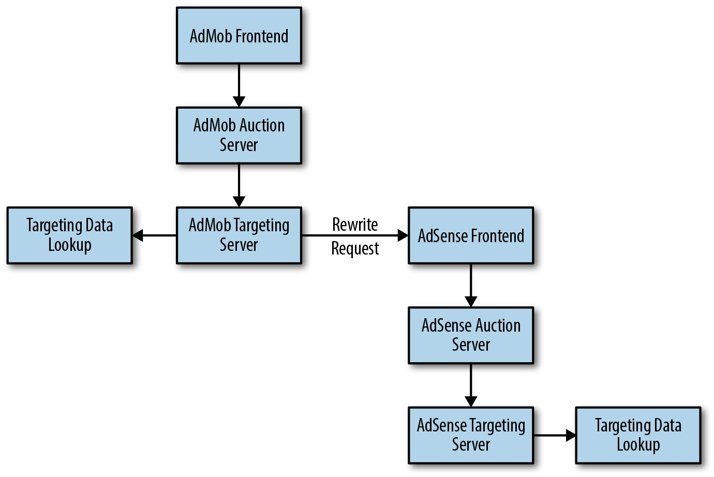

# **第7章**

### **简单化**

 

***By John Lunney, Robert van Gent, and Scott Ritchie with Diane Bates and Niall Richard Murphy***

  

> *一个有效的复杂系统总是从一个简单的有效系统演化而来的。*
>
> [---加尔定律](http://bit.ly/2syRTi5)

  

简单化是SRE的重要目标，因为它与可靠性紧密相关:简单的软件中断的次数较少，并且在中断时更容易更快速地进行修复。简单的系统更易于理解，易于维护和测试。

对于SRE，简单化是端到端的目标:应该超越代码本身，扩展到系统体系结构以及用于管理软件生命周期的工具和过程。本章探讨了一些示例，这些示例演示了SRE如何衡量，思考和鼓励简单性。

## **测量复杂度**

衡量软件系统的复杂性并不是一门绝对的科学。测量软件代码复杂度的方法有很多种，其中大多数是相当客观的。[^55]也许最著名，使用最广泛的标准是[循环代码复杂度](http://bit.ly/1nKIrVc)，它通过一组特定的语句来测量不同代码路径的数量。例如，没有循环或条件的代码块的循环复杂度数(CCN)为1。实际上，软件社区非常擅长于测量代码的复杂性，并且有许多用于集成开发环境(包括Visual Studio，Eclipse和IntelliJ)的测量工具。我们不太善于理解所测得的复杂度是必要的还是偶然的，一种方法的复杂性如何影响更大的系统，以及哪种方法最适合重构。

另一方面，用于度量系统复杂性的正式方法很少见。[^56]您可能会想尝试一种CCN类型的方法来计算不同实体(例如微服务)的数量以及它们之间可能的通信路径。但是，对于大多数规模较大的系统，该数字可能会非常快地增长到无可救药的地步。

有关系统级复杂性的一些更实际的代表包括:

*训练时间*

> 新的团队成员需要多长时间才能上班？文档不足或缺失可能是主观复杂性的重要来源。

*解释时间*

> 向新的团队成员解释服务的全面高级视图(例如，在白板上绘制系统架构并解释每个组件的功能和依赖性)需要花费多长时间？

*管理多元化*

> 有多少种方法可以在系统的不同部分中配置相似的设置？配置存储在集中的位置还是多个位置？

*部署配置的多样性*

> 生产中部署了多少个独特的配置(包括二进制文件，二进制版本，标志和环境)？

*年龄*

> 系统多大了？[Hyrum定律](http://www.hyrumslaw.com/)指出，随着时间的流逝，API的用户取决于其实现的各个方面，从而导致脆弱和不可预测的行为。

尽管有时测量复杂性是值得的，但很难。但是，似乎没有对以下观点的严重反对:

- 通常，除非做出与之抗衡的努力，否则现有软件系统的复杂性将会增加。

- 付出努力是值得的。

## **简单化是端到端的，而SRE对此非常有用**

通常，生产系统的设计不是整体的。相反，它们有机地生长。随着团队增加新功能并推出新产品，他们会随着时间的推移积累组件和连接。尽管单个更改可能相对简单，但是每个更改都会影响其周围的组件。因此，总体复杂性很快就会变得不堪重负。例如，在一个组件中添加重试可能会使数据库超载并破坏整个系统的稳定性，或者使推理基于系统的给定查询的路径变得更加困难。

通常，复杂性的成本不会直接影响引入该复杂性的个人，团队或角色-从经济角度来讲，复杂性是外在的。相反，复杂性会影响那些继续在其中及其周围工作的人。因此，拥有端到端系统简化的拥护者很重要。

SRE很自然地适合担任此职务，因为他们的工作要求他们将系统视为一个整体。[^57]除了支持自己的服务外，SRE还必须洞悉与其服务交互的系统。Google的产品开发团队通常对生产范围的问题一无所知，因此他们认为向SRE咨询有关系统设计和运维的建议很有价值。

> 
> **读者行动:** 在工程师初次上线之前，鼓励他们绘制(并重新绘制)系统图。在您的文档中保留一套规范的图表:它们对新工程师很有用，并可以帮助更有经验的工程师跟上变化。

根据我们的经验，产品开发人员通常最终只能在狭窄的子系统或组件中工作。结果，他们没有整个系统的思维模型，他们的团队也没有创建系统级的架构图。这些图很有用，因为它们可以帮助团队成员可视化系统交互并使用通用词汇表述问题。通常，我们发现该服务的SRE团队绘制了系统级体系结构图。

>
> **读者行动:** 确保SRE审核所有主要设计文档，并确保团队文档显示新设计如何影响系统体系结构。如果设计增加了复杂性，那么SRE可能会提出简化系统的替代方案。

## **案例研究1: 端到端API简单化**

**背景**

上一章的作者曾在一家初创公司工作，该公司在其核心库中使用键/值袋数据结构。RPC(远程过程调用)拿了一个袋子并归还了一个袋子；实际参数作为键/值对存储在包装袋中。核心库支持对包的常规操作，例如序列化，加密和日志记录。所有核心库和API都非常简单和灵活-成功，对吧？

遗憾的是，没有:库的客户最终为核心API的抽象性质付出了代价。对于每个服务，键和值(以及值类型)的集合需要仔细记录，但通常不需要。另外，随着时间的增加，删除或更改参数，保持后向/向前兼容性变得困难。

**经验教训**

[Google's Protocol Buffers](http://bit.ly/1HhFC5L)或[Apache Thrift](https://thrift.apache.org/)之类的结构化数据类型似乎比其抽象的通用替代品更为复杂，但是由于它们可以强制进行前期设计决策和文档化，因此它们可提供更简单的端到端解决方案。

## **案例研究2: 项目生命周期的复杂性**

当您查看现有系统这个混乱的意大利面条时，可能会很想用一个新的，干净，简单的系统来替换它，以解决相同的问题。不幸的是，在维持现有系统的同时创建新系统的成本可能不值得。

**背景**

[Borg](http://bit.ly/2LgqcTd)是Google的内部容器管理系统。它运行着大量的Linux容器，并具有多种使用模式:批处理与生产，管道与服务器等。多年来，Borg及其周围的生态系统随着硬件的变化，功能的添加以及规模的增长而增长。

[Omega](http://bit.ly/2HdcFJo)旨在成为Borg的原则更清晰的版本，支持相同的用例。但是，从Borg到Omega的计划中的转换存在一些严重的问题:

- 随着Omega的发展，Borg不断发展，因此Omega一直在追求一个不断变化的目标。

- 对改善Borg的难度的早期估计被证明过于悲观，而对Omega的期望被证明过于乐观(实际上，草并不总是较绿)。

- 我们不完全理解从Borg迁移到Omega会有多么困难。跨数千个服务和许多SRE团队的数百万行配置代码意味着，迁移在工程和日历时间方面将是极其昂贵的。在可能需要数年的迁移期间，我们必须支持和维护这两个系统。

**我们决定要做的**

[最终](http://bit.ly/2Lf4FKm)，我们将在设计Omega时出现的一些想法反馈回了Borg。我们还使用了Omega的许多概念来启动[Kubernetes](https://kubernetes.io/)，一个开源容器管理系统。

**经验教训**

在考虑重写时，请考虑整个项目生命周期，包括朝着不断变化的目标进行开发，完整的迁移计划以及在迁移时间段内可能产生的额外费用。具有很多广泛用户的API很难迁移。不要将预期结果与当前系统进行比较。相反，如果将相同的精力投入到改进它上，则将预期结果与当前系统的外观进行比较。有时重写是最好的方法，但是请确保已权衡成本和收益，并且不要低估成本。

## **保持简单**

大多数简化工作包括从系统中删除元素。有时，简化是直接的(例如，消除对从远程系统获取的未使用数据的依赖)。其他时候，简化需要重新设计。例如，系统的两个部分可能需要访问相同的远程数据。而不是两次获取数据，一个更简单的系统可能会一次获取数据并转发结果。

无论做什么工作，领导层都必须确保简化工作得到庆祝并明确地确定优先次序。简化就是效率-代替节省计算或网络资源，它可以节省工程时间和认知负担。就像对待有用的功能启动一样对待成功的简化项目，并平等地衡量和庆祝代码的添加和删除。[^58]例如，Google的内网为删除大量代码的工程师显示“僵尸代码杀手”徽章。

简化是一个功能。您需要确定简化项目的优先级并为其配备人员，并为SRE留出时间来处理它们。如果产品开发人员和SRE认为简化项目对他们的职业不利，那么他们将不会进行这些项目。考虑将简单化作为特别复杂的系统或超负荷团队的明确目标。创建一个单独的时间来完成这项工作。例如，为“简单化”项目预留工程项目时间的10％。[^59]

>**读者行动:** 让工程师集思广益，讨论系统中已知的复杂性，并讨论降低这些复杂性的想法。

随着系统复杂性的增加，有一种诱惑来分裂SRE团队，将每个新团队集中在系统的较小部分上。尽管有时这是必要的，但新团队的规模缩小可能会降低他们推动更大的简化项目的动力或能力。考虑指定一个SRE轮值小组，他们维护整个堆栈的工作知识(可能深度较小)，但可以推动整个堆栈的一致性和简化性。

如前所述，对系统进行图表绘制可以帮助您识别更深层的设计问题，这些问题会妨碍您理解系统并预测其行为。例如，在绘制系统示意图时，您可能会寻找以下内容:

*放大*

> 当调用返回错误或超时并在多个级别上重试时，它将导致RPC总数增加。

*循环依赖*

> 当组件(通常是间接地)依赖于自身时，系统完整性可能会受到严重损害-尤其是整个系统的冷启动可能变得不可能。

## **案例研究3: 简化展示广告Spiderweb**

**背景**

Google的展示广告业务拥有许多相关产品，其中包括一些源自收购的产品(DoubleClick，AdMob，Invite Media等)。这些产品必须经过修改才能与Google基础架构和现有产品一起使用。例如，我们希望使用DFP广告管理系统的网站能够展示Google AdSense选择的广告；同样，我们希望使用DoubleClick Bid Manager的投标人可以访问在Google Ad Exchange上进行的实时拍卖。

这些独立开发的产品形成了一个很难推理的互连后端系统。观察流量通过组件时发生的情况很困难，并且为每块资源提供适当的容量是不方便且不精确的。在某一时刻，我们添加了测试以确保我们删除了查询流中的所有无限循环。

**我们决定要做什么**

投放SRE的广告是标准化的自然推动力:尽管每个组件都有一个特定的开发人员团队，但SRE在整体堆栈中处于待命状态。我们的首要任务之一是起草统一性标准，并与开发团队合作逐步采用它们。这些标准为:

- 建立了复制大型数据集的单一方法

- 建立了执行外部数据查找的单一方法

- 提供了用于监控，配置和配置的通用模板

在此倡议之前，单独的程序为每种产品提供了前端和拍卖功能。如图7-1所示，当一个广告请求可能同时到达两个定位系统时，我们重新编写了该请求以满足第二个系统的期望。这需要额外的代码和处理，并且还开辟了不良循环的可能性。

>

*图7-1.以前，广告请求可能会同时在AdMob和AdSense系统上运行*

为了简化系统，我们在满足所有用例的通用程序中添加了逻辑，并添加了标记来保护程序。随着时间的流逝，我们删除了这些标记并将功能合并到更少的服务器后端中。

服务器统一后，拍卖服务器可以直接与两个目标服务器通信。如图7-2所示，当多个目标服务器需要数据查找时，在统一拍卖服务器中查找只需进行一次。

>

*图7-2.统一拍卖服务器现在仅执行一次数据查找*

**经验教训**

最好将已经运行的系统逐步集成到您自己的基础架构中。

就像在单个程序中存在非常相似的功能表示“代码臭气”表明更深的设计问题一样，在单个请求中的冗余查找也表示“系统臭气”。

当您通过SRE和开发人员的支持来创建定义明确的标准时，您可以提供清晰的蓝图，以消除管理人员更可能认可和奖励的复杂性。

## **案例研究4:** 在共享平台上运行数百个微服务

*由迈克·柯蒂斯(Mike Curtis)*撰写

**背景**

在过去的15年中，Google开发了多个成功的产品垂直市场(仅举几个例子，包括Search，Ads和Gmail)，并产生了稳定的新系统和重构系统。这些系统中的许多系统都有专门的SRE团队和相应的特定领域生产堆栈，其中包括定制开发工作流程，持续集成和持续交付(CI/CD)软件周期以及监控。这些独特的生产堆栈会在维护，开发成本和独立的SRE投入方面产生大量的开销。它们也使在团队之间移动服务(或工程师！)或添加新服务变得更加困难。

**我们决定要做什么**

在社交网络领域中的一组SRE团队致力于将其服务的生产堆栈聚合到一个由一组SRE管理的单一托管微服务平台中。共享平台符合最佳实践，并且捆绑并自动配置了许多以前未充分使用的功能，这些功能可提高可靠性并促进调试。无论SRE参与程度如何，都需要使用SRE团队范围内的新服务来使用公共平台，并且旧服务必须迁移到新平台或被淘汰。

在社交网络领域获得成功后，共享平台已被Google的其他SRE和非SRE团队采用。

**设计**

我们使用了微服务，因此我们可以快速更新和部署功能-单个整体服务的更改缓慢。服务是“被管理(managed)”的，而不是“被托管(hosted)”的:不是让单个团队摆脱控制和责任，而是让他们自己有效地管理他们的服务。我们提供了服务团队可以用来发布，监控以及更多功能的工作流工具。

我们提供的工具包括一个UI，API和一个命令行界面，SRE和开发人员可以使用它们与他们的堆栈进行交互。这些工具使开发人员的体验变得统一，即使涉及许多基础系统也是如此。

**结果**

该平台的高质量和功能集带来了意想不到的好处:开发人员团队可以在无需任何SRE参与的情况下运行数百种服务。

通用平台还改变了SRE与开发人员的关系。因此，“分层”SRE参与在Google中变得很普遍。分层参与使一系列SRE被包含其中，遍布从轻度咨询和设计审查到深度参与(即，SRE共同承担On-Call职责)。

**经验教训**

从稀疏或定义不明确的标准过渡到高度标准化的平台是一项长期投资。每个步骤都可能是渐进式的，但最终，这些步骤会减少开销，并使大规模运行服务成为可能。

开发人员在这种过渡中看到价值非常重要。目标是在开发的每个阶段都释放出提高生产率的胜利。不要试图说服人们进行巨大的重构，而这种重构只有在最后才有回报。

## **案例研究5: pDNS不再依赖于自己**

**背景**

当Google生产中的客户想要查找服务的IP地址时，通常会使用称为Svelte的查找服务。过去，为了查找Svelte的IP地址，客户端使用了名为pDNS(生产DNS)的Google命名服务。通过负载平衡器访问pDNS服务，该负载平衡器使用Svelte查找实际pDNS服务器的IP地址。

**问题陈述**

pDNS本身具有传递性依赖关系，在某个时候无意中引入了它，直到后来才将其确定为可靠性问题。通常不会出现问题，因为复制了pDNS服务，并且破坏了数据

依赖循环之外的功能始终可以在Google产品中的某个位置使用。但是，冷启动是不可能的。用一个SRE的话来说，“我们就像是洞穴居民，他们只能用最后一次篝火点燃的火炬来点燃火。”

**我们决定要做什么**

我们修改了Google生产中的低级组件，以维护所有Google生产计算机在本地存储中附近Svelte服务器的当前IP地址列表。除了打破前面描述的循环依赖关系之外，此更改还消除了大多数其他Google服务对pDNS的隐式依赖关系。

为了避免类似的问题，我们还介绍了一种将允许与pDNS通信的服务集列入白名单的方法，并逐步减少了该服务集。结果，生产中的每个服务查找现在都具有通过系统的更简单和更可靠的路径。

**经验教训**

请注意您的服务的依赖性-使用明确的白名单来防止额外意外。另外，请注意循环依赖。

**结论**

对于SRE而言，简单化是一个自然的目标，因为简单的系统倾向于可靠且易于运行。从数量上衡量分布式系统的简单化(或它的逆向性，复杂性)并不容易，但是有一些合理的代表，值得选择一些并进行改进。

由于SRE对系统具有端到端的了解，因此它们非常适合识别，预防和修复复杂性源，无论它们是在软件设计，系统体系结构，配置，部署过程还是其他位置发现的。SRE应该尽早参与设计讨论，以提供其对替代方案的成本和收益的独特见解，并特别注重简单化。SRE还可主动制定标准以使生产同质化。

作为SRE，追求简单是您工作描述的重要组成部分。我们强烈建议SRE领导授权SRE团队推动简单化，并明确奖励这些努力。系统在发展过程中不可避免地会趋于复杂，因此为简单起见，需要不断的关注和投入-但它非常值得追求。
