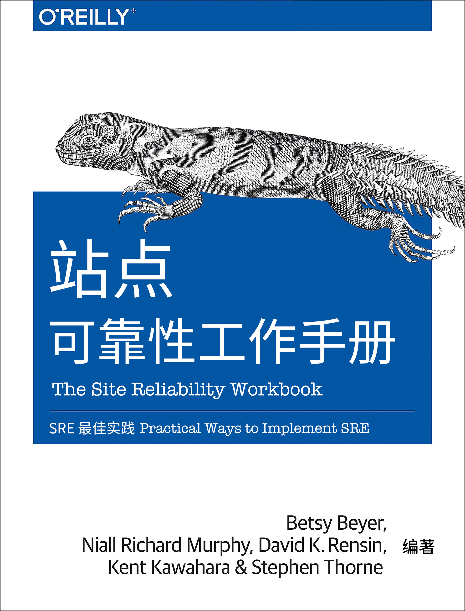

# The Site Reliability Workbook 站点可靠性工作手册 中文版

[前言 I](2_前言-I.md)

[前言 II](3_前言-II.md)

[序言](4_序言.md)

[第1章 SRE和DevOps的关系](5_第1章-SRE和DevOps的关系.md)

[第一部分 基础](6_第一部分-基础)
- [第2章 实施SLO](6_第一部分-基础/6-1_第2章-实施SLO.md)
- [第3章 SLO工程案例研究](6_第一部分-基础/6-2_第3章-SLO工程案例研究.md)
- [第4章 监控](6_第一部分-基础/6-3_第4章-监控.md)
- [第5章 基于SLO发出警报](6_第一部分-基础/6-4_第5章-基于SLO发出警报.md)
- [第6章 消除琐事工作](6_第一部分-基础/6-5_第6章-消除琐事工作.md)
- [第7章 简单化](6_第一部分-基础/6-6_第7章-简单化.md)

[第二部分 实践](7_第二部分-实践)
- [第8章 值班](7_第二部分-实践/7-1_第8章-值班.md)
- [第9章 事件响应](7_第二部分-实践/7-2_第9章-事件响应.md)
- [第10章 事后总结文化: 从失败中学习](7_第二部分-实践/7-3_第10章-事后总结文化-从失败中学习.md)
- [第11章 管理负载](7_第二部分-实践/7-4_第11章-管理负载.md)
- [第12章 介绍非抽象大型系统设计](7_第二部分-实践/7-5_第12章-介绍非抽象大型系统设计.md)
- [第13章 数据处理管道](7_第二部分-实践/7-6_第13章-数据处理管道.md)
- [第14章 配置设计和最佳实践](7_第二部分-实践/7-7_第14章-配置设计和最佳实践.md)
- [第15章 配置细节](7_第二部分-实践/7-8_第15章-配置细节.md)
- [第16章 金丝雀发布](7_第二部分-实践/7-9_第16章-金丝雀发布.md)

[第三部分 流程](8_第三部分-流程)
- [第17章 识别过载并从中恢复](8_第三部分-流程/8-1_第17章-识别过载并从中恢复.md)
- [第18章 SRE参与模型](8_第三部分-流程/8-2_第18章-SRE参与模型.md)
- [第19章 SRE-超越自己](8_第三部分-流程/8-3_第19章-SRE-超越自己.md)
- [第20章 SRE团队生命周期](8_第三部分-流程/8-4_第20章-SRE团队生命周期.md)
- [第21章 SRE中的组织变革管理](8_第三部分-流程/8-5_第21章-SRE中的组织变革管理.md)

[总结](9_总结.md)

[附录A SLO文档示例](10_附录A-SLO文档示例.md)

[附录B 错误预算政策示例](11_附录B-错误预算政策示例.md)

[附录C 事后分析的结果](12_附录C-事后分析的结果.md)
